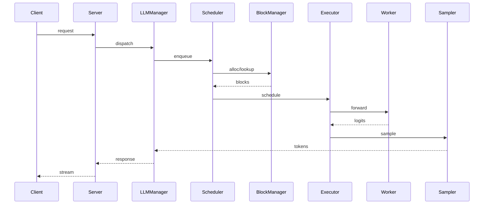
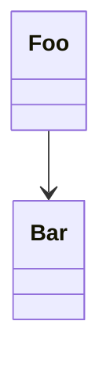
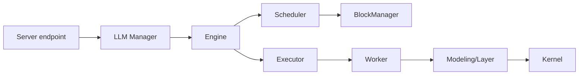

# <Feature 名> 深度解读（vX.Y）

> 适用版本：MindIE-LLM <git tag / commit>
> 作者：<name> | 日期：<YYYY-MM-DD>
> 关联文档：`docs/zh/user_guide/feature/<feature>.md`

## 0. TL;DR

- 一句话定义：…
- 核心价值（≤3 条）：…
- 是否推荐生产开启：✅ / ❌（条件：…）

## 1. 需求价值

| 维度 | 内容 | 出处 |
|------|------|------|
| 业务收益 | TTFT / TPOT / 吞吐 / 显存 / 精度的预期改善 | … |
| 工程收益 | 路径简化 / 复用 / 解耦 | … |
| 适用场景 | … | … |
| 反场景 | … | … |
| 量化预期 | benchmark 数据 | `docs/.../benchmark.md` |

## 2. 需求设计

### 2.1 抽象模型
- 关键概念：…

### 2.2 端到端时序

### 2.3 数据结构

### 2.4 关键配置项

| 配置项 | 默认 | 含义 | 出处 |
|--------|------|------|------|
| `xxx` | `0` | … | `config.conf` / `runtime/conf/...` |

## 3. 代码结构

### 3.1 调用链路

### 3.2 关键文件

| # | 路径 | 角色 | 关键类/函数 |
|---|------|------|-------------|
| 1 | `src/scheduler/scheduler.cpp` | … | `Scheduler::schedule` |
| 2 | `src/block_manager/prefix_cache_block_allocator.cpp` | … | `…` |
| 3 | `mindie_llm/text_generator/plugins/<feature>/…` | … | `…` |

### 3.3 Python ↔ C++ 边界
- 桥接位置：`src/llm_manager_v2/` & `mindie_llm/text_generator/cpp/`
- 共享内存 / pybind / proto：…

## 4. 实现细节

逐文件给出：
- 数据结构 / 算法 / 复杂度
- 并发模型 / 同步点
- 内存管理 / 拷贝路径
- 错误处理 / 降级
- 可观测埋点

> 引用代码用 `startLine:endLine:filepath` 格式。

## 5. 工程 Trick

1. **<trick 1>** — `path:lines` — 收益：…
2. **<trick 2>** — `path:lines` — 收益：…
3. **<trick 3>** — `path:lines` — 收益：…

## 6. 实现不足 / 风险

1. **<风险 1>** — 现状 / 复现路径 / 建议修复方式
2. **<风险 2>** — …
3. **<风险 3>** — …

## 7. vLLM / SGLang 竞品对比

### 7.1 概念映射
（见 `competitor_matrix_template.md` 第 0 节）

### 7.2 13 维对比表
（套用 `competitor_matrix_template.md` 模板，逐行填实证据）

### 7.3 结论
- **领先**：…
- **对齐**：…
- **落后**：…
- **借鉴**：vLLM `<path>` / SGLang `<path>`

## 8. 补充维度

| 维度 | 现状 | 建议 |
|------|------|------|
| 精度对齐 | … | … |
| 性能基准 | `examples/...`，KPI：… | … |
| 可观测性 | … | … |
| 安全性 | `security.md` 第 X 节 | … |
| 兼容性矩阵 | `docs/zh/user_guide/feature/README.md` | … |
| Feature Flag / 回滚 | `config.conf` 项 | … |
| 测试覆盖 | `tests/ut/...`、`tests/st/...` | … |
| 演进路线 | release_notes / TODO | … |
| 跨团队边界 | ATB / CANN / ACLGraph | … |
| 历史故障 | issue # / PR # | … |

## 9. 行动建议

- 短期（≤3 条，明确文件 + 改动范围）：
  1. …
- 中期（≤3 条）：
  1. …
- 开放问题：
  1. …
