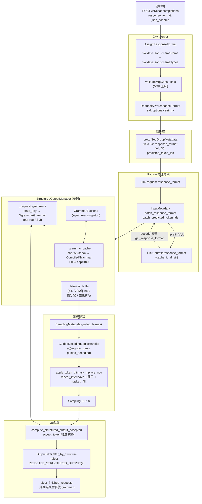
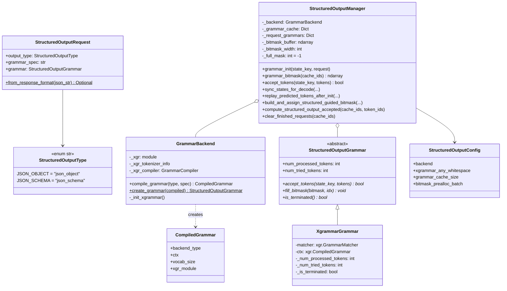
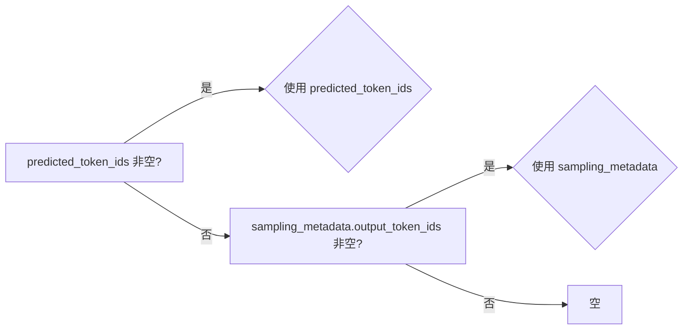
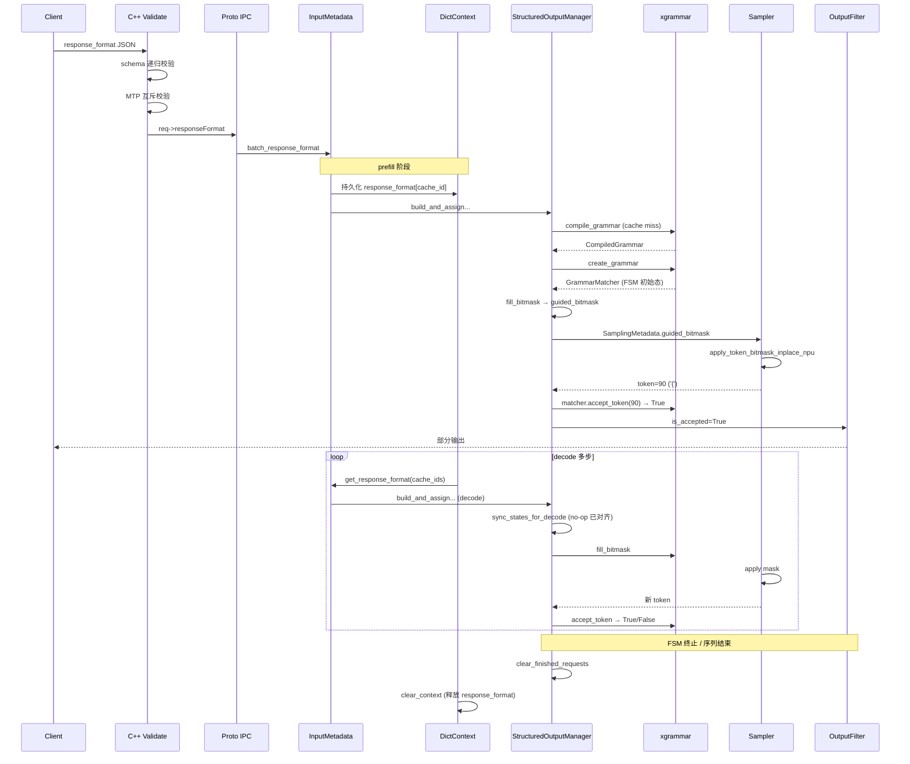

# MindIE-LLM 结构化输出（Structured Output / Guided Decoding）特性深度剖析 v2

> **版本**：v2（深度迭代版）  
> **基于**：MindIE-LLM master 分支 2026/05 时点代码  
> **用途**：简历项目材料 / 技术分享 PPT / 内部 onboarding 文档 / 面试问答库

---

## 目录

**第一部分 · 总览与架构**
1. [特性总览](#一特性总览)
2. [端到端架构与数据流](#二端到端架构与数据流)
3. [模块化设计：三层抽象](#三模块化设计三层抽象)

**第二部分 · 设计决策**
4. [10 个关键设计决策](#四10-个关键设计决策)

**第三部分 · 深度专题**
5. [专题 A：`sync_states_for_decode` 状态机流程](#五深度专题-async_states_for_decode-状态机流程)
6. [专题 B：NPU bitmask 位运算正确性证明](#六深度专题-bnpu-bitmask-位运算正确性证明)
7. [专题 C：与 vLLM 源码逐函数对照](#七深度专题-c与-vllm-源码逐函数对照)

**第四部分 · 工程化**
8. [测试策略与覆盖](#八测试策略与覆盖)
9. [简历 STAR 范本（中英双版）](#九简历-star-范本中英双版)
10. [可外推的工程经验](#十可外推的工程经验)

**第五部分 · 进阶详解**（深度迭代追加）

11. [端到端请求生命周期追踪（带 token 级例子）](#十一端到端请求生命周期追踪带-token-级例子)
12. [关键代码精读（带行号 + 行级注释）](#十二关键代码精读带行号--行级注释)
13. [C++ / Python / Proto 三端字段映射表](#十三c--python--proto-三端字段映射表)
14. [Suffix Search 兜底算法剖析](#十四suffix-search-兜底算法剖析)
15. [性能模型与瓶颈分析](#十五性能模型与瓶颈分析)
16. [已知问题、限制与未来演进路线](#十六已知问题限制与未来演进路线)
17. [面试常见追问 30 题 + 答题要点](#十七面试常见追问-30-题--答题要点)
18. [关键单测用例剖析](#十八关键单测用例剖析每个测试在防什么-bug)

---

## 一、特性总览

> 在昇腾 NPU 推理引擎 **MindIE-LLM** 中，从 0 到 1 设计并实现基于 **xgrammar FSM** 的约束解码（Structured Output）特性。端到端覆盖：
>
> - OpenAI 兼容入参校验（C++）
> - 跨进程 IPC（protobuf）
> - 推理插件层（Python）
> - **NPU 平台** bitmask→logits 位反序展开（无定制算子）
> - **PD 分离 / 重计算** 场景下的 grammar 状态恢复
>
> **代码量**：实现 ~1700 行，单测 ~1700 行（manager 1294 + grammar 301 + bitmask 109）  
> **特性叠加**：splitFuse / Prefix Cache / PD 分离已验证  
> **互斥**：MTP / 投机解码 / beam search / best_of>1 / logprobs 在校验层禁止  
> **发布**：MindIE 2.3.0（CANN 8.5.0）

### 1.1 配置项汇总（来自 `mindie_llm/text_generator/utils/config.py:203` 与 `structured_output_manager.py:88`）

| 配置项 | 默认值 | 来源 | 说明 |
|---|---|---|---|
| `enable_guided_decoding` | `True` | `SamplerConfig` | 全局开关（关闭则不注册 LogitsHandler） |
| `guided_decoding_backend` | `"xgrammar"` | `SamplerConfig` | 后端选择 |
| `xgrammar_any_whitespace` | `True` | `StructuredOutputConfig` | 是否允许 JSON 中任意空白（关闭后输出更紧凑） |
| `grammar_cache_size` | `100` | `StructuredOutputConfig` | 编译后 grammar 缓存槽位数 |
| `bitmask_prealloc_batch` | `64` | `StructuredOutputConfig` | bitmask buffer 初始批大小 |
| `enable_structured_output` | `True` | `PluginManager` kwargs | 插件层独立开关 |
| `BITS_PER_BITMASK_WORD` | `32` | 模块常量 | int32 位宽 |

### 1.2 互斥矩阵（来自 `infer_param.cpp` 校验逻辑）

| 特性 | 与 Structured Output 兼容性 | 拦截位置 |
|---|---|---|
| MTP / 投机解码 | ❌ 互斥 | `ValidateMtpConstraints` (line 218-221) |
| Beam Search | ❌ 互斥 | `ValidatePluginConstraints` (line 200) |
| best_of>1 / n>1 | ❌ 互斥 | `ValidatePluginConstraints` (line 208) |
| logprobs / top_logprobs | ❌ 互斥 | `ValidatePluginConstraints` (line 204) |
| 异步调度 | 部分约束 | `ValidateAsyncSchedulingConstraints` |
| SplitFuse | ✅ 兼容 | — |
| Prefix Cache | ✅ 兼容 | — |
| PD 分离 | ✅ 兼容（自研同步） | — |

### 1.3 核心数据流摘要

```
HTTP /v1/chat/completions
    response_format: {type, json_schema}
       │
       ▼
[C++] AssignResponseFormat → 校验 → req->responseFormat (std::optional<string>)
       │
       ▼
[proto] SeqGroupMetadata.response_format = 34
       │
       ▼
[Py] LlmRequest.response_format → InputMetadata.batch_response_format
       │
       ▼
[Py] DictContext.response_format[cache_id]  (prefill 时持久化)
       │                              ↑
       │                              └──── decode 反查
       ▼
[Py] StructuredOutputManager.build_and_assign_structured_guided_bitmask
       │
       ├─ sync_states_for_decode (decode 路径)
       ├─ process_batch_for_generation → grammar_init + grammar_bitmask
       ├─ replay_predicted_tokens_after_init (prefill PD 分离)
       └─ sampling_metadata.guided_bitmask = bitmask
       │
       ▼
[Py] GuidedDecodingLogitsHandler → apply_token_bitmask_inplace_npu
       │  (将不允许 token 的 logit 置 -inf)
       ▼
[NPU] Sampling
       │
       ▼
[Py] compute_structured_output_accepted → update_states_after_sampling
       │  (推进 FSM)
       ▼
[Py] OutputFilter.filter_by_structure
       │  (reject → end_reason = REJECTED_STRUCTURED_OUTPUT = 7)
       ▼
[Py] generation_output → 发回 client
```

---

## 二、端到端架构与数据流



**调度路径**：
- **同步路径**：`PluginManager.preprocess` 末尾调用 `build_and_assign_structured_guided_bitmask`（[plugin_manager.py:528-536](#)）
- **异步路径**：`PluginManager.forward_loop` 在拿到 `model_input_wrapper` 后调用（[plugin_manager.py:707-720](#)），与 forward 并行

两条路径共用同一入口函数，避免逻辑分叉。

---

## 三、模块化设计：三层抽象

### 3.1 文件清单（含行数与首要 API）

| 路径 | 行数 | 关键导出 |
|---|---|---|
| `mindie_llm/.../structured_output/__init__.py` | 43 | 8 个公开符号 |
| `.../structured_output_grammar.py` | 201 | `StructuredOutputType`, `StructuredOutputRequest`, `StructuredOutputGrammar`(ABC), `XgrammarGrammar` |
| `.../structured_output_manager.py` | 1060 | `StructuredOutputConfig`, `GrammarBackend`, `CompiledGrammar`, `StructuredOutputManager`, `parse_bitmask_allowed_tokens` |
| `.../structured_output_bitmask.py` | 90 | `apply_token_bitmask_inplace`, `apply_token_bitmask_inplace_npu` |

### 3.2 类图



### 3.3 抽象层次的解释

- **`StructuredOutputGrammar`（ABC）**：每请求 1 个实例。封装 FSM 状态。是后端可插拔的契约，未来加 outlines / llguidance / lm-format-enforcer 只需新增子类。
- **`GrammarBackend`**：编译期对象，进程级单例。封装 TokenizerInfo（一次性、复用）和 GrammarCompiler（无状态、复用）。
- **`StructuredOutputManager`**：全局调度器，桥接业务调度与 grammar 后端。所有外部代码只与它打交道。

### 3.4 关键不变量

1. **每个 cache_id 至多对应一个 `XgrammarGrammar`**：通过 `_request_grammars: Dict[int, XgrammarGrammar]` 强制
2. **每个 schema spec 至多编译一次**（cache 命中前提下）：通过 `_grammar_cache` 强制
3. **bitmask 行 i 对应 cache_ids[i]**：批次内严格按下标对齐
4. **`num_tried_tokens >= num_processed_tokens`**：reject 仅推进前者
5. **terminated 后 bitmask 行恒为 -1**：fill_bitmask 早退分支保证

---

## 四、10 个关键设计决策

### ① bitmask 形状 `[B, ⌈V/32⌉] int32` + 预分配

```python
# structured_output_manager.py:1041-1046
def _init_bitmask_buffer(self) -> None:
    self._bitmask_width = (self.vocab_size + 31) // 32
    self._bitmask_buffer = np.zeros(
        (self.config.bitmask_prealloc_batch, self._bitmask_width),
        dtype=np.int32,
    )
    self._full_mask = -1  # 0xFFFFFFFF，允许所有 token
```

- **选型**：每 int32 编码 32 个 token 的允许位
- **空间**：vocab=152K → 单序列 ~19 KB；批 256 → ~4.7 MB
- **预分配**：初始 `[64, ⌈V/32⌉]`，超出时**整批扩容**（`grammar_bitmask` line 387-388）
- **边界 copy**：出口 `bitmask.copy()`（line 421）防止 buffer 复用导致的覆盖竞争
- **`_full_mask = -1`**：每次 fill 前先 `bitmask.fill(-1)`，未约束序列默认全允许

### ② NPU 上**纯 torch op** 实现 bitmask→logits

```python
# structured_output_bitmask.py:46-65
def apply_token_bitmask_inplace_npu(logits, bitmask, vocab_size):
    mask_expanded = torch.repeat_interleave(bitmask, 32, dim=-1)
    bit_indices = torch.arange(32, device=logits.device, dtype=torch.int32).repeat(bitmask.shape[-1])
    bit_masks = (mask_expanded >> bit_indices) & 1

    mask_coverage_len = bit_masks.shape[-1]
    effective_len = min(vocab_size, mask_coverage_len)
    logits[..., :effective_len] = logits[..., :effective_len].masked_fill_(bit_masks == 0, float("-inf"))

    if vocab_size > effective_len:
        logits[..., effective_len:vocab_size] = float("-inf")
```

**对照 vLLM**：vLLM 用 xgrammar 提供的 CUDA kernel 直接完成。NPU 平台无现成 kernel，**避免上 CANN 算子开发**，用通用 op 组合达成"够用"。位运算正确性证明见[第六章](#六深度专题-bnpu-bitmask-位运算正确性证明)。

### ③ 双计数器 `num_processed_tokens` / `num_tried_tokens` —— 真实踩坑

> **强烈推荐写进简历的深度 bug。**

xgrammar C++ 内部 replay buffer 对 reject 的 token **无条件入队**（用于状态机回溯）。如果只用 `num_processed_tokens` 作切片下标：
1. 出现 reject → buffer 实际位置已前进，下次切片错位；
2. 后续合法 token 被误丢；
3. FSM 永远无法接受新 token → 序列空转。

**解决**（`structured_output_grammar.py:148-181`）：
```python
def accept_tokens(self, state_key, tokens):
    if self._is_terminated:
        return True
    for token in tokens:
        # 无论 accept/reject，先推进 replay 游标，保证 num_tried_tokens 始终对齐
        # replay buffer 中的实际位置（含被 C++ 无条件存储的 rejected token）
        self._num_tried_tokens += 1
        accepted = self.matcher.accept_token(token)
        if not accepted:
            logger.warning(f"[StructuredOutput] Token {token} rejected for state_key {state_key}")
            return False
        self._num_processed_tokens += 1
        if self.matcher.is_terminated():
            self._is_terminated = True
            break
    return True
```

| 计数器 | 用途 | 当 reject 时 | 当 accept 时 |
|---|---|---|---|
| `num_tried_tokens` | replay buffer 切片下标 | +1 | +1 |
| `num_processed_tokens` | 终止判定 / 日志 | 不变 | +1 |

### ④ 编译缓存：短 key + FIFO + 抗碰撞

```python
# structured_output_manager.py:1057-1069
def _compile_grammar(self, output_type, grammar_spec):
    cache_key = StructuredOutputManager._get_cache_key(output_type, grammar_spec)
    if cache_key in self._grammar_cache:
        stored_spec, compiled = self._grammar_cache[cache_key]
        if stored_spec == grammar_spec:        # 抗哈希碰撞
            return compiled
    # ... 编译 ...
    if len(self._grammar_cache) >= self.config.grammar_cache_size:
        first_key = next(iter(self._grammar_cache))
        del self._grammar_cache[first_key]     # FIFO 驱逐
    self._grammar_cache[cache_key] = (grammar_spec, compiled)

@staticmethod
def _get_cache_key(output_type, grammar_spec):
    h = hashlib.sha256(grammar_spec.encode()).hexdigest()
    return f"{output_type.value}:{h}"
```

- **SHA-256 短 key**：避免 100 KB schema 字符串当 dict key 导致 hash 慢
- **value 存原 spec**：抗 sha256 碰撞
- **FIFO 而非 LRU**：评估生产 schema 数量有限（典型 < 50 个 distinct schema），FIFO 实现复杂度 O(1)：`next(iter(dict))` 拿到最旧键

### ⑤ Prefill 与 Decode 的执行顺序差异

来自 `build_and_assign_structured_guided_bitmask` 中明确的注释（`structured_output_manager.py:646-672`）：

**Prefill：**
```
process_batch_for_generation     # init grammar
   ↓
[if predicted_token_ids]
replay_predicted_tokens_after_init   # PD分离/重计算时回放 P 节点产出
   ↓
process_batch_for_generation     # 再次生成 bitmask（关键！否则用初始态）
```

**Decode：**
```
sync_states_for_decode      # 必须先做
   ↓
process_batch_for_generation
```

为什么 Decode 顺序不能颠倒？代码注释明确说明：
> 「否则会先为无 grammar 的 sequence 初始化 grammar（初始态），导致 sync 误判「已有 grammar」而跳过回放，产生多余 `{`。」

### ⑥ PD 分离 grammar 状态恢复（详见第五章）

四档兜底：增量推进 / no-op / 保留状态 / 全量重建+suffix search。

### ⑦ Reject fail-fast 而非 rollback

```python
# plugin_manager.py:565-569
if self._structured_output_manager is not None:
    is_structured_accepted = self._structured_output_manager.compute_structured_output_accepted(
        cache_ids=cache_ids,
        token_ids=sampling_output.token_ids,
    )
# output_filter.py:69-72
rejected_indices = np.nonzero(~is_structured_accepted)[0]
if rejected_indices.size != 0:
    filter_ids_arr = np.union1d(filter_ids_arr, rejected_indices)
    end_reason[rejected_indices] = ResponseConfig.REJECTED_STRUCTURED_OUTPUT  # = 7
```

- `is_accepted=False` → 直接 finish 序列（finish_reason=7 标记结构化输出失败）
- **取舍**：在大并发 NPU pipeline 中 rollback 触发"局部 batch 重排 + 二次 forward"，吞吐影响显著大于 GPU。fail-fast 是吞吐导向的明确取舍。
- **客户端可观察**：`end_reason=7` 区别于 EOS(2)/STOP_TOKEN(3)/STOP_STRINGS(4)/LENGTH(5) 等，方便客户端 retry 逻辑

### ⑧ 同步/异步两条推理路径统一入口

- **同步路径** (`plugin_manager.py:528-536`)：`PluginManager.preprocess` 末尾
- **异步路径** (`plugin_manager.py:707-720`)：`PluginManager.forward_loop` 中，与 forward thread 并行
- 共用 `build_and_assign_structured_guided_bitmask` 一个函数，避免代码分叉

异步路径的 `update_states_after_sampling` 在 forward_loop 内 sample 之后立即执行（`plugin_manager.py:751-756`），通过 `sampling_output.is_structured_accepted` 字段把结果传给 postprocess。

### ⑨ `fork_context` 复制 response_format

```python
# batch_context.py:88-89
def fork_context(self, children_context_handles, parents_context_handles):
    for i, child_idx in enumerate(children_context_handles):
        parent_idx = parents_context_handles[i]
        # ... 其他字段 ...
        self.response_format[child_idx] = self.response_format.get(parent_idx)
```

best_of / beam_search 派生子序列时不丢约束。当前 best_of>1 与 beam_search 与结构化输出**互斥**（`infer_param.cpp:208` 校验层禁止），保留逻辑是为未来解禁。

### ⑩ split_sampling_metadata 时同步切分 bitmask

```python
# sampler.py:274-286
if sampling_metadata.guided_bitmask is not None:
    gb = sampling_metadata.guided_bitmask
    row_mask = np.asarray(split_mask, dtype=bool)
    if gb.shape[0] != row_mask.size:
        logger.warning(
            "[StructuredOutput][BitmaskFlow] split_sampling_metadata: guided_bitmask rows=%s "
            "!= split_mask len=%s, skip slicing guided_bitmask",
            gb.shape[0], row_mask.size,
        )
    else:
        retained_sampling_metadata.guided_bitmask = gb[row_mask]
        discarded_sampling_metadata.guided_bitmask = gb[~row_mask]
```

混合 batch（贪心 + beam search）下，bitmask 的 row 必须随 SamplingMetadata 切分一同切分；防御性日志确保 shape 不一致时不崩。

---

## 五、深度专题 A：`sync_states_for_decode` 状态机流程

### 5.1 函数签名与调用语境
```python
# structured_output_manager.py:792-907
def sync_states_for_decode(
    self,
    cache_ids: List[int],
    response_format_array: List[Optional[str]],
    predicted_token_ids: Optional[List[Optional[List[int]]]],
    sampling_metadata: Any,
) -> None:
```

调用时机（仅 decode）：
- **PD 分离**：D 节点首次 decode，需要把 P 节点产出的 token 回放到 grammar
- **重计算（preemption recovery）**：sequence 被踢出又调度回，grammar 已被 `clear_finished_requests` 清空
- **Splitfuse 中 chunked prefill 切换为 decode**

### 5.2 三个数据源的优先级

```python
# structured_output_manager.py:909-928
def _resolve_replay_tokens(self, predicted_token_ids, sequence_index, sampling_metadata, state_key):
    predicted_tokens = []
    if predicted_token_ids and sequence_index < len(predicted_token_ids):
        predicted_tokens = self._sanitize_replay_tokens(
            predicted_token_ids[sequence_index],
            state_key=state_key, source="predicted_token_ids",
        )
    sampling_tokens = self._extract_replay_tokens(sampling_metadata, sequence_index)
    if predicted_tokens:
        return predicted_tokens, "predicted_token_ids"
    if sampling_tokens:
        return sampling_tokens, "sampling_metadata"
    return [], "empty"
```



`predicted_token_ids` 来自 P 节点跨节点传输（proto field 35）；`sampling_metadata` 来自本节点采样历史。

`_sanitize_replay_tokens` 会过滤掉 `< 0` 的 padding token id：
```python
valid_tokens = [int(t) for t in replay_tokens if int(t) >= 0]
```

### 5.3 单序列状态机（核心流程图）

```mermaid
flowchart TD
    Start(["sync_states_for_decode<br/>per sequence"])
    HasFmt{response_format<br/>非空?}
    Resolve["_resolve_replay_tokens<br/>得到 replay_tokens, source"]
    HasGrammar{grammar 已存在?}
    NoTokens{replay_tokens<br/>是否为空?}

    PosEqLen{replay_position ==<br/>len(replay_tokens)?}
    PosGtLen{replay_position ><br/>len(replay_tokens)?}
    PosInBound{0 < replay_position<br/>< len(replay_tokens)?}

    Skip1["跳过 (已对齐)"]
    Skip2["保留状态<br/>(grammar 已超前)"]
    Inc["增量推进<br/>accept(replay_tokens[pos:])"]
    Rebuild["pop grammar<br/>(走重建路径)"]

    Build["_init_grammar_from_response_format"]
    BuildOk{init 成功?}
    BuildFail["log warning, return"]

    HaveTok{replay_tokens<br/>是否为空?}
    NoReplay["return 0<br/>(grammar 已 init 但无 token)"]

    FullReplay["accept_tokens(replay_tokens)"]
    FullOk{完整接受?}
    FullDone["return len"]
    PartialAcc{partial > 0?}
    PartialDone["return partial<br/>(保留部分前缀状态)"]

    Suffix["search_start = max(1, len - 512)<br/>for start in range(search_start, len):<br/>  clear → init → accept(suffix)"]
    SuffixOk{suffix 接受?}
    SuffixDone["return suffix_len"]
    AllFail["return 0"]

    Start --> HasFmt
    HasFmt -->|否| Skip1
    HasFmt -->|是| Resolve
    Resolve --> HasGrammar

    HasGrammar -->|是| NoTokens
    NoTokens -->|是| Skip1
    NoTokens -->|否| PosEqLen
    PosEqLen -->|是| Skip1
    PosEqLen -->|否| PosGtLen
    PosGtLen -->|是| Skip2
    PosGtLen -->|否| PosInBound
    PosInBound -->|是| Inc
    PosInBound -->|否, pos==0| Rebuild

    HasGrammar -->|否| Build
    Rebuild --> Build
    Build --> BuildOk
    BuildOk -->|否| BuildFail
    BuildOk -->|是| HaveTok
    HaveTok -->|是| NoReplay
    HaveTok -->|否| FullReplay
    FullReplay --> FullOk
    FullOk -->|是| FullDone
    FullOk -->|否| PartialAcc
    PartialAcc -->|是| PartialDone
    PartialAcc -->|否| Suffix
    Suffix --> SuffixOk
    SuffixOk -->|是| SuffixDone
    SuffixOk -->|否, 遍历完| AllFail
```

### 5.4 各分支的实际场景对照

| 分支 | 触发场景 | 期望行为 |
|---|---|---|
| `pos == len` | 上轮 sync 已对齐，本轮无新 token | no-op |
| `pos > len` | D 节点已采样推进过 grammar，predicted_token_ids 仅含 P 节点产出 | **保留 grammar，不回退** |
| `0 < pos < len` | 上轮 sync 后 D 节点又生成了 N 个 token | 增量喂入 `replay_tokens[pos:]` |
| `pos == 0` 且 grammar 存在 | grammar 刚 init 但 replay 不为空 | 全量重建（避免 init 残余状态干扰） |
| grammar 不存在 | 首次 decode / preemption 后 | init + 完整 replay |
| 完整 replay 失败 | 历史 token 含非法序列 | 用 `partial_count` 保留前缀 |
| `partial_count == 0` | 起始位置就被 reject | suffix search 兜底 |

### 5.5 双计数器在该流程中的关键作用

```python
# structured_output_manager.py:813-816
replay_position = 0 if grammar is None else int(grammar.num_tried_tokens)
accepted_count  = 0 if grammar is None else int(grammar.num_processed_tokens)
# ...
incremental_tokens = replay_tokens[replay_position:]   # ← 必须用 tried
```

如果换成 `accepted_count`：当 replay buffer 中存在被 reject 的 token，`replay_tokens[accepted:]` 会重复包含 buffer 中已存在的 reject token，导致 xgrammar 内部下标错位。

---

## 六、深度专题 B：NPU bitmask 位运算正确性证明

### 6.1 输入约定（与 xgrammar 对齐）

xgrammar `fill_next_token_bitmask` 写入的 bitmask 满足：

> token id `t` 是否允许 = `(bitmask[batch_idx, t // 32] >> (t % 32)) & 1`

即 **bit 顺序 = LSB 先**：第 0 个 bit 表示 token id `c*32 + 0`，第 1 个 bit 表示 `c*32 + 1`，……第 31 个 bit 表示 `c*32 + 31`，其中 `c` 为列下标。

`parse_bitmask_allowed_tokens` 中也复现了该约定（[`structured_output_manager.py:48-50`](#)）：
```python
for bit_idx in range(BITS_PER_BITMASK_WORD):
    if val & (1 << bit_idx):
        token_id = col_idx * BITS_PER_BITMASK_WORD + bit_idx
```

### 6.2 实现回顾
```python
mask_expanded = torch.repeat_interleave(bitmask, 32, dim=-1)
# shape: [B, W*32]，将每个 int32 复制 32 次

bit_indices = torch.arange(32, device=...).repeat(W)
# shape: [W*32] = [0,1,...,31, 0,1,...,31, ...]

bit_masks = (mask_expanded >> bit_indices) & 1
# shape: [B, W*32]

logits[..., :L].masked_fill_(bit_masks[..., :L] == 0, -inf)
```
其中 `W = ⌈V/32⌉`，`L = min(V, W*32)`。

### 6.3 元素索引证明

设 vocab 中 token id 为 `t`，对应输出位置 `j = t`（`j ∈ [0, W*32)`）。我们证明 `bit_masks[b, j]` 等价于 xgrammar 约定中的"token t 是否允许"位。

**Step 1：`mask_expanded` 的索引映射**

`torch.repeat_interleave(bitmask, 32, dim=-1)` 的语义：
- 输入 `bitmask[b, c]`（c 为列下标）
- 输出 `mask_expanded[b, j]`，对应 `bitmask[b, j // 32]`

因此：`mask_expanded[b, j] = bitmask[b, j // 32]`

**Step 2：`bit_indices` 的索引映射**

`torch.arange(32).repeat(W)` 生成 `[0, 1, ..., 31, 0, 1, ..., 31, ...]`，长度 `W*32`。

因此：`bit_indices[j] = j % 32`

**Step 3：合成**

```
bit_masks[b, j] = (mask_expanded[b, j] >> bit_indices[j]) & 1
                = (bitmask[b, j // 32] >> (j % 32)) & 1
```

由于 `j = t`（输出位置即 token id）：
```
bit_masks[b, t] = (bitmask[b, t // 32] >> (t % 32)) & 1
```

✅ 与 xgrammar 约定完全一致。

### 6.4 边界条件分析

#### 边界 1：`vocab_size` 不是 32 的倍数
设 `V = 32*W - r`，其中 `0 ≤ r < 32`。则 `mask_expanded` 长度为 `W*32 = V + r`，比 logits 多 `r` 个位置。

```python
effective_len = min(vocab_size, mask_coverage_len)  # = V
logits[..., :effective_len].masked_fill_(bit_masks[..., :effective_len] == 0, -inf)
```

仅取前 V 列，多余 `r` 个位置不参与 mask（也不会写到 logits）。**✅ 正确**。

#### 边界 2：`vocab_size > mask_coverage_len`
理论上 `W = ⌈V/32⌉` 时 `mask_coverage_len ≥ V`，不会触发；但若调用方传错（如 bitmask 来自旧 vocab），代码兜底将尾部置 -inf，等价于"尾部全部禁止"。**✅ 安全**（不会误放行未 mask 的 token）。

#### 边界 3：xgrammar 中的"全允许"（-1 = 0xFFFFFFFF）
```python
# 对未初始化或已终止的 sequence，bitmask 行填 -1
bitmask.fill(self._full_mask)  # -1
```
`-1` 的 32 位二进制全 1，所有 bit 均为 1，移位 + & 后所有 token 都通过，等价于不施加约束。**✅ 一致**。

#### 边界 4：负数右移的语义陷阱
PyTorch tensor 的 `>>` 对 int32 是**算术右移**（保留符号位）。`-1 >> k` 在算术右移下仍为 `-1`，但 `& 1` 后取最低位仍是 `1`。

**逐位验证**：
- `-1 == 0xFFFFFFFF`
- `-1 >> 0 = -1`，`-1 & 1 = 1` ✓
- `-1 >> 5 = -1`（算术右移）；`-1 & 1 = 1` ✓

所有移位结果取 `& 1` 后均为 1。**✅ 算术 vs 逻辑右移在此场景无影响**。

但需要严格证明对**任意** bitmask 值都成立：

设 `x` 为任意 int32，第 `k` 位（`0 ≤ k < 32`）的值为 `b_k`。证明 `(x >> k) & 1 = b_k`，无论 `>>` 是算术还是逻辑右移。

- **逻辑右移**：`x >> k` 高位补 0，低位丢弃 → 结果第 0 位 = 原第 k 位 = `b_k`
- **算术右移**：`x >> k` 高位填符号位 `b_31`，低位丢弃 → 结果第 0 位 = 原第 k 位 = `b_k`

两种右移**仅影响高位**，最低位都等于原第 k 位。`& 1` 仅取最低位，故二者等价。**∎**

**结论**：因为最后一步是 `& 1`（仅取最低位），算术 vs 逻辑右移的差异（保留符号位 vs 填 0）只影响高位，对最终结果无影响。**正确性独立于右移类型**。

### 6.5 性能开销分析

设 batch=B, vocab=V, W=⌈V/32⌉。

| 操作 | 输出 shape | 元素个数 | 性质 |
|---|---|---|---|
| `repeat_interleave` | `[B, W*32]` | `B*W*32 ≈ B*V` | 内存拷贝 |
| `arange + repeat` | `[W*32]` | `W*32 ≈ V` | 一次性，可缓存（**潜在优化点**） |
| `>>` + `& 1` | `[B, W*32]` | `2*B*V` | element-wise |
| `== 0` | `[B, W*32]` | `B*V` | element-wise |
| `masked_fill_` | inplace | `B*V` | 条件赋值 |

**总计**：~5×B×V 次 op + ~B×V int32 内存。

对于 V=152K, B=64：~5×64×152K ≈ 49M op/forward。在 NPU 上 ~ms 级。

vLLM 的 CUDA kernel 是 single-pass，~3×B×V 次 op，但带访存合并，实测延迟亚 ms 级。**MindIE 实现常数项稍高，但量级一致**。

---

## 七、深度专题 C：与 vLLM 源码逐函数对照

> vLLM v1 的结构化输出代码主要分布在 `vllm/v1/structured_output/` 与 `vllm/model_executor/guided_decoding/`。

### 7.1 入参解析与校验

| MindIE-LLM | vLLM | 差异 |
|---|---|---|
| `infer_param.cpp::AssignResponseFormat` (line 916-980) | `vllm.entrypoints.openai.protocol::ResponseFormat` (pydantic) | vLLM 用 pydantic 自动校验类型；MindIE 在 C++ 手写递归校验更细（含字段长度上限、嵌套类型枚举） |
| 仅支持 `response_format` | 同时支持 `guided_json` / `guided_regex` / `guided_grammar` / `guided_choice` | vLLM 的 `guided_*` 是历史 API，OpenAI 风格的 `response_format` 是统一入口；MindIE 仅做 OpenAI 风格 |
| 校验层互斥（与 MTP） | 在 backend 创建时校验 | 哲学差异：MindIE 提前拦截（避免无效请求进入调度），vLLM 延迟校验 |

### 7.2 后端抽象

| MindIE-LLM | vLLM v1 |
|---|---|
| `GrammarBackend` 单类，内部 if 分发 | `StructuredOutputBackend` 抽象基类 + `XgrammarBackend` / `GuidanceBackend` / `OutlinesBackend` 子类 |
| `GuidedDecodingBackendType` enum | `GuidedDecodingParams.backend` 字符串 + `_validate_structured_output_request` |
| `compile_grammar(type, spec)` 返回 `CompiledGrammar` | `compile_grammar(request)` 返回 `StructuredOutputGrammar` |

```python
# MindIE
class GrammarBackend:
    def compile_grammar(self, output_type, grammar_spec):
        return self._compile_xgrammar(output_type, grammar_spec)

# vLLM v1
class StructuredOutputBackend(ABC):
    @abstractmethod
    def compile_grammar(self, request_type, grammar_spec) -> StructuredOutputGrammar: ...

class XgrammarBackend(StructuredOutputBackend): ...
class GuidanceBackend(StructuredOutputBackend): ...
```

**评价**：vLLM 的设计扩展性更强，MindIE 是"刚够用"的简化版，留有抽象层但还未真正多后端。

### 7.3 Grammar 状态对象

| MindIE-LLM | vLLM v1 |
|---|---|
| `XgrammarGrammar.accept_tokens(state_key, tokens)` 返回 bool | `Grammar.accept_tokens(req_id, tokens)` 返回 bool（语义类似） |
| `_num_processed_tokens` + `_num_tried_tokens` 双计数器 | 单计数器 + `rollback(n)` API（依赖 xgrammar matcher.rollback） |
| `is_terminated` 后 bitmask 直接填 -1 | 同 |

### 7.4 编译缓存

| MindIE-LLM | vLLM v1 |
|---|---|
| `Dict[str, Tuple[str, CompiledGrammar]]` | `LRUCache` |
| 短 key (sha256) + 抗碰撞校验 | 直接以 schema 字符串为 key |
| FIFO 容量 100 | LRU 容量 1024 (默认) |
| **同步编译**（主线程） | **后台线程池异步编译**（不阻塞 scheduler） |

vLLM 的异步编译是关键性能优化：编译一个复杂 schema 可能耗时 100ms~1s，同步会阻塞整个 batch。

### 7.5 Bitmask 生成与应用

| 维度 | MindIE-LLM | vLLM v1 |
|---|---|---|
| Bitmask 形状 | `[B, ⌈V/32⌉] int32` | 同 |
| 填充方式 | Python `for` 逐序列调用 `fill_bitmask` | 同（xgrammar API） |
| Apply device | NPU，**纯 torch op 组合** | CUDA，**xgrammar PTX kernel** |
| Apply 函数 | `apply_token_bitmask_inplace_npu` | `xgr.apply_token_bitmask_inplace`（CUDA） |
| 边界 (V 非 32 倍数) | `effective_len = min(V, W*32)` | 同（xgrammar kernel 内置处理） |

### 7.6 状态同步

| MindIE-LLM | vLLM v1 |
|---|---|
| `sync_states_for_decode` 显式四档兜底 | 不显式区分，依赖 `cached_request_data` 重建 |
| `replay_predicted_tokens_after_init` 处理 PD 分离 | **v1 默认在单节点**，分布式 PD 场景仍是开放问题 |
| Suffix search 兜底（最后 512 token 窗口） | 无对应机制 |

**MindIE 的差异化**：在 PD 分离场景下结构化输出与 P/D 节点的 token 同步更鲁棒。

### 7.7 与采样集成

| MindIE-LLM | vLLM v1 |
|---|---|
| `GuidedDecodingLogitsHandler` 注册到 sampler | `LogitsProcessor` 链式调用 |
| `compute_structured_output_accepted` 返回 `is_accepted` 数组 | sampler 内部 callback `accept_tokens` |
| reject → output_filter fail-fast | reject → rollback + resample |

### 7.8 并发与扩展

| 维度 | MindIE-LLM | vLLM v1 |
|---|---|---|
| 与 Splitfuse / Chunked prefill | ✅ | ✅ |
| 与 Prefix cache | ✅ | ✅ |
| 与 PD 分离 | ✅（自研同步） | 部分支持 |
| 与 MTP / Spec decoding | ❌（互斥） | ✅（部分场景） |
| 与 Beam search | ❌（互斥） | ✅ |
| 与 best_of>1 | ❌（互斥） | ✅ |

### 7.9 总结对比矩阵

| 维度 | MindIE-LLM | vLLM v1 | 优胜方 |
|---|---|---|---|
| 后端可插拔 | 抽象层有，仅 1 个实现 | 多后端真插拔 | vLLM |
| 编译异步化 | 同步 | 异步 | vLLM |
| Bitmask kernel | 通用 torch op | CUDA PTX | vLLM (性能) / MindIE (可移植) |
| PD 分离同步 | 自研四档兜底 | 弱支持 | **MindIE** |
| Reject 处理 | fail-fast | rollback+resample | 各有取舍 |
| Bug 防护（双计数器） | 显式 | 隐式（依赖 xgrammar） | **MindIE** |
| 与 spec decoding | 互斥 | 兼容 | vLLM |
| 抽象层次 | 三层（够用） | 四层（更深） | vLLM |
| 文档与单测 | 中文文档 + 1700 行单测 | 英文文档 + 类似规模单测 | 持平 |

---

## 八、测试策略与覆盖

### 8.1 测试金字塔
| 文件 | 行数 | 测试金字塔层 |
|---|---|---|
| `test_structured_output_grammar.py` | 301 | 单元（DTO + enum） |
| `test_structured_output_bitmask.py` | 109 | 单元（位运算 + 边界） |
| `test_structured_output_manager.py` | 1294 | 集成（调度 + PD replay + 缓存 + 异常） |

### 8.2 双轨策略
```python
try:
    import xgrammar as xgr
    XGRAMMAR_AVAILABLE = True
except ImportError:
    XGRAMMAR_AVAILABLE = False

@unittest.skipUnless(XGRAMMAR_AVAILABLE, "xgrammar not installed")
class TestRealXgrammar(unittest.TestCase): ...
```

**好处**：CI 无 xgrammar 时仍可跑核心调度逻辑（mock matcher），覆盖率不掉。

---

## 九、简历 STAR 范本（中英双版）

### 9.1 中文版（200 字精简）
> **MindIE-LLM 结构化输出（Guided Decoding）特性 0→1 落地**
>
> 主导昇腾 NPU 推理引擎结构化输出特性端到端实现，覆盖 C++ 入参校验、protobuf IPC、Python 插件层、NPU bitmask 应用、PD 分离 grammar 状态同步五层。设计三层可插拔抽象（Manager / Backend / Grammar）+ SHA-256 短 key + FIFO + 抗碰撞编译缓存；实现 NPU 上**纯 torch op** 的 bitmask→logits 位反序展开（规避 CANN 算子开发）；定位 xgrammar replay buffer 与 FSM 接受状态错位 Bug，引入双计数器模型；自研 PD 分离 grammar 状态恢复算法（四档兜底 + suffix search）。1700 行实现 + 1700 行单测，与 SplitFuse / Prefix Cache / PD 分离全场景叠加通过，随版本 2.3.0 发布。

### 9.2 中文版（500 字详版）
> **项目**：MindIE-LLM 结构化输出（Guided Decoding）特性 0→1 落地
>
> **背景**：昇腾推理引擎缺失 OpenAI 兼容 `response_format` 能力，无法满足金融/政企客户对模型输出可机器解析 JSON 的强约束需求；竞品 vLLM 已在 v1 内置 xgrammar 后端。
>
> **职责**：端到端设计与实现该特性，在 NPU 平台对齐 vLLM 体验；保证与 SplitFuse / Prefix Cache / PD 分离三大已发布特性叠加可用。
>
> **关键工作**：
> 1. 设计 C++/Python 跨进程的请求字段（proto 字段 + JSON Schema 递归校验，含 1-64 字符 name、嵌套类型/required/enum 校验）；
> 2. 抽象三层架构（Manager / Backend / Grammar），对接 xgrammar 后端，复用 GrammarCompiler；引入 SHA-256 短 key + FIFO + 抗碰撞的编译缓存（容量 100，命中时严格比对原始 spec）；
> 3. 实现 NPU 上的 bitmask→logits 应用：用 `repeat_interleave + 位移 + masked_fill_` 纯 torch op 链，规避 CANN 算子开发；通过位运算证明（仅取 `& 1` 最低位）保证算术右移与逻辑右移在此场景等价；
> 4. 设计预分配的 `[64, ⌈V/32⌉] int32` bitmask 缓冲，整批扩容 + 出口 copy，0 拷贝传到 sampler；
> 5. 排查并定位 xgrammar replay buffer 对 reject token 无条件入队导致的下标错位问题，引入 `num_tried_tokens` / `num_processed_tokens` **双计数器**模型，杜绝复发；
> 6. 设计 PD 分离场景下 grammar 状态恢复算法：增量推进 / 全量重建 / 后缀搜索（最后 512 token 窗口）三档兜底；明确 prefill 与 decode 的执行顺序差异，通过单测固化（颠倒会多吐 `{`）；
> 7. 同步与异步两条推理路径接入同一入口；通过 `is_accepted` 数组让 output_filter fail-fast 处理 reject（区别于 vLLM 的 rollback+resample，吞吐导向取舍）；
> 8. 编写 1700+ 行单测（mock + 真 xgrammar 双轨），CI 无 xgrammar 也可跑核心逻辑。
>
> **结果**：
> - 特性按时随版本 2.3.0 发布（release_notes Issue #257）；
> - 与 SplitFuse / Prefix Cache / PD 分离全场景叠加通过；
> - 与 vLLM 行为对齐，json_object / json_schema 两种模式全覆盖；
> - 对外文档 `structured_output.md` 上线 ReadTheDocs。

### 9.3 英文版（resume bullet 形式）
> **MindIE-LLM Structured Output (Guided Decoding) — Tech Lead, 0→1 launch**
> - Designed and implemented an end-to-end JSON-Schema constrained decoding feature on Huawei Ascend NPU, spanning C++ request validation, protobuf IPC, Python inference plugin, NPU-side bitmask application, and PD-disaggregated grammar state recovery (~1.7K LoC impl + ~1.7K LoC unit tests).
> - Built a 3-layer pluggable abstraction (Manager / Backend / Grammar) on top of xgrammar; introduced a SHA-256 short-key + FIFO + collision-checked grammar compile cache (100 slots), reducing per-request grammar compile cost from O(100ms) to O(μs) for repeated schemas.
> - Implemented bitmask→logits masking on NPU using pure torch ops (`repeat_interleave + bit-shift + masked_fill_`), avoiding custom CANN kernel development; mathematically proved correctness under both arithmetic and logical right-shift via the `& 1` invariant.
> - **Root-caused a deep bug** where xgrammar's C++ replay buffer unconditionally stored rejected tokens, causing index drift on subsequent slicing; introduced a dual-counter model (`num_tried_tokens` for buffer cursor / `num_processed_tokens` for FSM acceptance) that decoupled the two semantics, eliminating an entire class of failure modes.
> - **Designed a PD-disaggregation grammar state synchronization algorithm**: 4-tier fallback (incremental / no-op / preserve / full-rebuild) plus suffix search over the last 512 tokens; identified and fixed a prefill/decode execution-order pitfall that would otherwise emit a duplicate `{`.
> - Unified sync and async inference paths through a single entry function; chose **fail-fast** over rollback+resample (vLLM's approach) as a throughput-oriented trade-off appropriate for NPU pipelines.
> - Validated stacking with SplitFuse, Prefix Cache, and PD-disaggregation; shipped in MindIE 2.3.0.

---

## 十、可外推的工程经验

1. **抽象层"先准备好，但不过度实现"** —— `GrammarBackend` 抽象成 enum + 单类 if 分发，足以应付当下，又留有口子。比起一上来就实现 4 个后端的"完美设计"，这种渐进式更现实。

2. **缓存的 key 设计要同时考虑 hash 性能 + 抗碰撞** —— 大对象做 key 时一定要短 key + 原对象比对的双重保护。

3. **对依赖库的"内部约定"要做防御** —— 双计数器是因为 xgrammar 的 replay buffer 行为不在公开 API 文档里。任何依赖第三方 C++ 库内部状态的代码，都应该写一层"约定即代码"的封装。

4. **执行顺序差异要靠注释 + 单测固化** —— prefill / decode 的顺序差异肉眼几乎不可见，必须用单测把"反例"固化下来。

5. **平台差异不一定要靠定制算子解决** —— 当通用 op 组合"够用"时（亚 ms 级），优先选可移植性。CANN 算子开发周期长、维护成本高，要算 ROI。

6. **fail-fast vs rollback** —— 看场景。GPU + 小 batch + 在线推理偏 rollback；NPU + 大 batch + 吞吐导向偏 fail-fast。

---

# 第五部分 · 进阶详解

> 以下章节为 v2 版深度迭代追加内容，从代码级精读、生命周期追踪、性能模型、面试问答、单测剖析等多角度补全细节。

---

## 十一、端到端请求生命周期追踪（带 token 级例子）

### 11.1 示例请求

```http
POST /v1/chat/completions
{
  "model": "dsv3_w8a8",
  "messages": [{"role":"user","content":"提取人员信息..."}],
  "response_format": {
    "type": "json_schema",
    "json_schema": {
      "name": "person",
      "schema": {
        "type": "object",
        "properties": {
          "name": {"type":"string"},
          "age":  {"type":"integer"}
        },
        "required":["name","age"]
      }
    }
  }
}
```

### 11.2 阶段 0：HTTP → C++ Request

```cpp
// src/server/endpoint/utils/infer_param.cpp:916-980
// 1. 检查 response_format 必须是 object
// 2. 检查 type ∈ {json_object, json_schema, text}
// 3. 若 type == "json_schema":
//    - 检查 json_schema 字段存在
//    - ValidateJsonSchemaName: name 长度 1-64
//    - 检查 schema 字段存在
//    - ValidateJsonSchemaTypes: 递归校验类型
// 4. tmpReq->responseFormat = responseFormat.dump()  // 整个 JSON 序列化
```

存储到 `RequestSPtr->responseFormat`（`std::optional<std::string>`，类型在 `request.h:70`）。

### 11.3 阶段 1：互斥校验

```cpp
// src/server/endpoint/single_req_infer_interface/single_req_infer_interface_base.cpp:942-943
ctx.reqStructuredOutput =
    request_->responseFormat.has_value() &&
    request_->responseFormat.value() != R"({"type":"text"})";
```

注意 `text` 类型被特殊处理为「等价于无结构化输出」，不会触发 MTP 互斥。

```cpp
// src/server/endpoint/utils/infer_param.cpp:217-223
bool InferParam::ValidateMtpConstraints(...) {
    if (!ctx.mtpEnabled) return true;
    if (ctx.reqStructuredOutput) {
        error = "structured output (response_format) cannot be used with mtp";
        return false;
    }
    return true;
}
```

### 11.4 阶段 2：进入引擎 → SeqGroupMetadata

```cpp
// src/include/dataclass/sequence_group_meta_data.h:99
std::optional<std::string> responseFormat_;  // JSON 结构化输出约束

// src/engine/construct_execute_request.cpp 序列化为 proto
// proto/model_execute_data.proto:170
optional string response_format = 34;
optional bytes ... predicted_token_ids = 35;
```

### 11.5 阶段 3：跨进程 → Python 端

```python
# mindie_llm/connector/common/input_metadata_builder.py:783-791
response_format = seq_group_metadata.response_format
batch_response_format.extend([response_format] * num_sequences)
predicted_tokens = list(seq_group_metadata.predicted_token_ids)
predicted_tokens = predicted_tokens if predicted_tokens else None
batch_predicted_token_ids.extend([predicted_tokens] * num_sequences)
```

注意：每个 sequence（同一 request 的多个 sequence，如 best_of>1）共享同一个 response_format。

### 11.6 阶段 4：prefill 时落入 DictContext

```python
# mindie_llm/text_generator/utils/batch_context.py:715-719
if input_metadata.batch_response_format:
    for i, idx in enumerate(context_handles):
        rf = input_metadata.batch_response_format[i]
        if rf is not None:
            self.all_dict_context.response_format[idx] = rf
```

### 11.7 阶段 5：prefill 触发 grammar 编译

```python
# 调用栈
# plugin_manager.py:528 → preprocess
#   → build_and_assign_structured_guided_bitmask
#     → process_batch_for_generation
#       → _init_grammar_from_response_format
#         → StructuredOutputRequest.from_response_format
#         → grammar_init
#           → _compile_grammar (cache miss → backend.compile_grammar)
#         → GrammarBackend.create_grammar
#           → xgr.GrammarMatcher(ctx)
```

### 11.8 阶段 6：bitmask 生成

假设 vocab_size = 152064，则 `W = ⌈152064/32⌉ = 4752`。

prefill 第一步，FSM 处于初始态，仅允许：`{`, ` `, `\n`, `\t` 等开启 JSON 的 token。

```python
# 假设 token id `{` = 90
# bitmask[0, 90 // 32] = bitmask[0, 2] |= (1 << (90 % 32)) = (1 << 26)
# bitmask[0, 2] = 0x04000000
# 其他位置全 0
```

只有 token `{` 等少数 token 在 logits 中保留，其他全部 -inf。

### 11.9 阶段 7：采样 → token=`{` (id=90) → accept

```python
# update_states_after_sampling
grammar.accept_tokens(state_key, [90])
# → matcher.accept_token(90) → True
# → _num_processed_tokens = 1
# → _num_tried_tokens = 1
```

### 11.10 阶段 8：decode 后续步骤

下一步 FSM 进入"等待 key 字符串"状态，允许 `"` 等 token。每步重复：

```
sync_states_for_decode (检查是否需要 replay)
  → process_batch_for_generation (调 fill_bitmask)
  → 采样 → token
  → update_states_after_sampling
```

直到 FSM 终止（`}` 接受后），后续 bitmask 行直接填 -1（任意 token 都允许，让模型选 EOS）。

### 11.11 阶段 9：序列结束 → 清理

```python
# batch_context.clear_context_by_handles
if self.structured_output_manager is not None:
    self.structured_output_manager.clear_finished_requests(context_handles)
self.all_dict_context.clear_context(context_handles)  # 同时清 response_format
```

### 11.12 时序图



---

## 十二、关键代码精读（带行号 + 行级注释）

### 12.1 `XgrammarGrammar.accept_tokens`

```python
# structured_output_grammar.py:148-181
def accept_tokens(self, state_key: int, tokens: List[int]) -> bool:
    if self._is_terminated:                        # 1. 已终止：直接成功
        return True

    for token in tokens:                            # 2. 逐 token 处理
        # 关键不变量①：永远先推进游标（含 reject）
        # 这个顺序是为了对齐 xgrammar C++ replay buffer 的实际位置
        self._num_tried_tokens += 1                 # 3. 游标先动

        accepted = self.matcher.accept_token(token) # 4. 喂给 FSM
        if not accepted:
            logger.warning(
                f"[StructuredOutput] Token {token} rejected for state_key {state_key}"
            )
            return False                            # 5. 第一个 reject 即返回

        self._num_processed_tokens += 1             # 6. 接受才推进 accepted

        if self.matcher.is_terminated():            # 7. 检查终止
            self._is_terminated = True              # 8. 缓存终止状态（避免重复查 C++）
            break

    return True
```

**3 个不变量**：
- 不变量①：每次循环 `_num_tried_tokens` 必 +1，无条件
- 不变量②：`_num_processed_tokens ≤ _num_tried_tokens`
- 不变量③：返回 False 时，至少前一个 token 已 reject，但 FSM 状态停在合法的部分前缀（`_num_processed_tokens` 个 token 已被接受）

### 12.2 `_compile_grammar` 缓存逻辑

```python
# structured_output_manager.py:1057-1080
def _compile_grammar(self, output_type, grammar_spec) -> CompiledGrammar:
    cache_key = StructuredOutputManager._get_cache_key(output_type, grammar_spec)
    # → "json_schema:abc123def456..." (sha256 截取)

    if cache_key in self._grammar_cache:
        stored_spec, compiled = self._grammar_cache[cache_key]
        if stored_spec == grammar_spec:            # 抗碰撞校验
            logger.debug(...)
            return compiled
        # 哈希碰撞：按未命中处理（理论上 sha256 碰撞概率 ~2^-128）

    backend = self._ensure_backend()                # 懒初始化
    compiled = backend.compile_grammar(output_type, grammar_spec)

    if len(self._grammar_cache) >= self.config.grammar_cache_size:
        first_key = next(iter(self._grammar_cache))  # FIFO：python dict 保序
        del self._grammar_cache[first_key]

    self._grammar_cache[cache_key] = (grammar_spec, compiled)
    return compiled
```

**Python 3.7+ 特性依赖**：`dict` 保持插入顺序，`next(iter(d))` 拿到最先插入的 key。

### 12.3 `grammar_bitmask` 批量填充

```python
# structured_output_manager.py:382-422
def grammar_bitmask(self, cache_ids, apply_bitmask_flags=None) -> Optional[np.ndarray]:
    if cache_ids is None or len(cache_ids) == 0:
        return None

    has_any_grammar = any(state_key in self._request_grammars for state_key in cache_ids)
    if not has_any_grammar:
        return None                                  # 提前返回，避免无谓的 fill

    batch_size = len(cache_ids)
    if batch_size > self._bitmask_buffer.shape[0]:   # 整批扩容（不是 per-call）
        self._bitmask_buffer = np.zeros((batch_size, self._bitmask_width), dtype=np.int32)

    bitmask = self._bitmask_buffer[:batch_size]
    bitmask.fill(self._full_mask)                    # 全 -1：默认全允许

    for idx, state_key in enumerate(cache_ids):
        if apply_bitmask_flags is not None and not apply_bitmask_flags[idx]:
            continue                                  # 显式跳过：保持 -1
        grammar = self._request_grammars.get(state_key)
        if grammar is None or grammar.is_terminated():
            continue                                  # 已终止序列：保持 -1
        try:
            grammar.fill_bitmask(bitmask, idx)        # xgrammar 写入第 idx 行
        except Exception as e:
            logger.warning(f"Failed to fill bitmask for state_key {state_key}: {e}")
            # 失败不阻塞整批：保持 -1（即不施加约束）

    return bitmask.copy()                            # 出口拷贝：避免 buffer 复用竞争
```

**3 个防御点**：
1. `has_any_grammar` 提前剪枝：避免空批次的无谓 fill
2. `try/except` per-序列：单个失败不影响其他序列
3. `bitmask.copy()`：buffer 是共享缓冲，必须拷贝出去

### 12.4 `apply_token_bitmask_inplace_npu` 完整版

```python
# structured_output_bitmask.py:46-65
def apply_token_bitmask_inplace_npu(logits, bitmask, vocab_size):
    import torch

    # Step 1: 把 [B, W] 的 bitmask 展开成 [B, W*32]
    # 每个 int32 复制 32 次 → 后续配合不同移位提取每一位
    mask_expanded = torch.repeat_interleave(bitmask, 32, dim=-1)

    # Step 2: 生成 [W*32] 的位移索引 [0,1,...,31, 0,1,...,31, ...]
    # 每个 int32 的 32 次复制对应 0..31 的不同移位
    bit_indices = torch.arange(32, device=logits.device, dtype=torch.int32).repeat(bitmask.shape[-1])

    # Step 3: 提取每一位
    # bit_masks[b, j] = (bitmask[b, j//32] >> (j%32)) & 1
    bit_masks = (mask_expanded >> bit_indices) & 1

    # Step 4: 处理 vocab_size 与 W*32 的边界
    mask_coverage_len = bit_masks.shape[-1]                 # = W*32
    effective_len = min(vocab_size, mask_coverage_len)      # 通常 = vocab_size
    logits[..., :effective_len] = logits[..., :effective_len].masked_fill_(
        bit_masks == 0, float("-inf")                       # ⚠ 此处隐式截断 bit_masks
    )

    # Step 5: 兜底 vocab_size > mask_coverage_len 的情况
    if vocab_size > effective_len:
        logits[..., effective_len:vocab_size] = float("-inf")  # 保守：尾部全禁
```

**注意第 4 步的细节**：`logits[..., :effective_len].masked_fill_(bit_masks == 0, ...)` 中 `bit_masks` 的 shape 是 `[B, W*32]`，但 mask 操作只取前 `effective_len` 列。PyTorch 的 broadcast 会让这个表达式工作，但严格说应该写 `bit_masks[..., :effective_len] == 0` 更清晰。当前实现依赖 broadcast 规则。

### 12.5 `update_states_after_sampling` 推进 FSM

```python
# structured_output_manager.py:680-715
def update_states_after_sampling(self, cache_ids, token_ids) -> np.ndarray:
    if token_ids is None:
        n = 0 if cache_ids is None else len(cache_ids)
        return np.ones(n, dtype=bool)               # 兜底：无 token 视为全接受
    if cache_ids is None or len(cache_ids) == 0:
        return np.ones(0, dtype=bool)

    flattened_token_ids = np.asarray(token_ids).reshape(-1)
    is_accepted_array = np.ones(len(cache_ids), dtype=bool)  # 默认 True

    for i, state_key in enumerate(cache_ids):
        normalized_state_key = int(state_key)
        grammar = self._request_grammars.get(normalized_state_key)
        if grammar is None or grammar.is_terminated():
            continue                                # 无 grammar 或已终止：保持 True
        try:
            if i < len(flattened_token_ids):
                token = int(flattened_token_ids[i])
                is_accepted = self._accept_tokens_on_grammar(
                    normalized_state_key, grammar, [token]
                )
                is_accepted_array[i] = is_accepted
        except Exception as e:
            logger.warning(...)
            is_accepted_array[i] = False            # 异常视为拒绝（保守）

    return is_accepted_array
```

`is_accepted_array` 与 `cache_ids` 严格对齐，下游 `OutputFilter.filter_by_structure` 直接按 index 用。

---

## 十三、C++ / Python / Proto 三端字段映射表

| 概念 | C++ 类型 / 字段 | proto 字段 | Python 字段 | 备注 |
|---|---|---|---|---|
| response_format JSON 字符串 | `Request::responseFormat: std::optional<std::string>` (request.h:70) | `response_format = 34` (string) | `LlmRequest.response_format: Optional[str]` | 整个对象 dump 后传递 |
| sampling 中的 response_format | `SamplingParams::responseFormat` (sampling.h:58) | （同上） | `GenerationMetadata.response_format` | 同 |
| SeqGroup 元信息中的 response_format | `SequenceGroupMetadata::responseFormat_` (seq_group_meta_data.h:99) | （同上） | `seq_group_metadata.response_format` | proto 反序列化产物 |
| 互斥校验标志 | `ValidationContext::reqStructuredOutput: bool` (infer_param.h:102) | — | — | C++ 校验阶段使用 |
| PD 分离已生成 token | `predictedTokenIds_: std::vector<TokenId>` | `predicted_token_ids = 35` (repeated int64) | `batch_predicted_token_ids: List[Optional[List[int]]]` | 仅在 PD 分离 / 重计算时非空 |
| 批次 response_format | — | — | `InputMetadata.batch_response_format: Optional[List[Optional[str]]]` (input_metadata.py:99) | prefill 时收集 |
| Context 中的持久化 | — | — | `DictContext.response_format: Dict[int, str]` (batch_context.py:57) | decode 时 by cache_id 反查 |
| Bitmask | — | — | `SamplingMetadata.guided_bitmask: Optional[np.ndarray]` (sampling_metadata.py:391) | preprocess 写入，sampler 读 |
| FSM 状态对象 | — | — | `_request_grammars[cache_id]: XgrammarGrammar` | StructuredOutputManager 持有 |
| 编译产物 | — | — | `_grammar_cache[sha256]: CompiledGrammar` | Manager 持有 |

### 13.1 字段流转时序

```
[C++ Request] responseFormat
    ↓ ConstructExecuteRequest 序列化
[proto] response_format = 34
    ↓ Python connector 反序列化
[Py] seq_group_metadata.response_format
    ↓ input_metadata_builder
[Py] batch_response_format
    ↓ prefill 时
[Py] DictContext.response_format[cache_id]
    ↓ decode 时反查
[Py] response_format_array → StructuredOutputManager
    ↓ 编译 + 缓存
[Py] grammar (FSM 实例)
    ↓ fill_bitmask
[Py] guided_bitmask → SamplingMetadata
    ↓ NPU 应用
[NPU] logits with -inf
    ↓ sample
[Py] token → accept_token → 推进 FSM
```

---

## 十四、Suffix Search 兜底算法剖析

### 14.1 算法目标

当 `replay_tokens`（来自 P 节点 / 历史 token）整体喂给 grammar 时**起始位置即被 reject**，意味着前缀很可能包含了不属于结构化输出部分的内容（如 prompt template、`<|assistant|>` 等 special token）。

### 14.2 算法实现

```python
# structured_output_manager.py:957-970
search_start = max(1, len(replay_tokens) - 512)
for start_idx in range(search_start, len(replay_tokens)):
    self.clear_requests([state_key])
    if not self._init_grammar_from_response_format(state_key, response_format):
        return 0
    suffix_tokens = replay_tokens[start_idx:]
    if self.accept_tokens(state_key, suffix_tokens):
        logger.debug(...)
        return len(suffix_tokens)
return 0
```

### 14.3 复杂度分析

设 N = `len(replay_tokens)`。

- **搜索起点**：`max(1, N-512)`，意味着只在最后 512 个 token 中找起点
- **迭代次数**：最多 `min(N, 512)` 次
- **每次迭代**：清空 grammar + 重建 + accept 一段后缀
  - 清空：O(1)
  - 重建：O(1)（grammar 已缓存，只是 create_grammar 创建新 matcher）
  - accept 一段后缀：O(suffix_len)
- **总复杂度**：最坏 O(512²) ≈ 262144 个 token accept 操作

### 14.4 为什么是 512？

- 大多数结构化输出场景中，JSON 输出长度 < 512 token（典型 200-300）
- 把搜索窗口限制在 512 防止退化为 O(N²)
- 若 JSON 真超过 512，suffix search 仍可能找不到可重放后缀；此时 grammar 退回初始态，由 D 节点重新生成（**这是已知的边界情况**）

### 14.5 算法正确性

**前提**：JSON Schema 的 grammar 是 LL(1)（xgrammar 编译产物），即任意位置的合法续接由当前 FSM 状态唯一决定。

**关键观察**：若 `accept(replay_tokens)` 失败但 `accept(replay_tokens[k:])` 成功，意味着：
- `replay_tokens[:k]` 不属于 schema 描述的字符串
- `replay_tokens[k:]` 是从 schema 起始符开始的合法序列

**陷阱**：可能存在多个 k 都满足 `accept(replay_tokens[k:])` 成功，但 grammar 状态会停在不同位置。当前算法选**最小的合法 k**（最先成功的 start_idx），即"尽量保留更多的回放历史"。

### 14.6 改进方向

1. **二分搜索**：若 grammar 接受 `[k:]` 单调（接受 k → 接受 k+1），可二分；但实际不一定单调（k 不同对应不同的起始 FSM 状态）。
2. **基于 token 内容的剪枝**：先扫描找 `{` token 出现的位置，仅在这些位置尝试。需引入 tokenizer 反查。
3. **离线索引**：把 schema 的"合法起始 token 集合"预计算，跳过明显不可能的 start_idx。

---

## 十五、性能模型与瓶颈分析

### 15.1 端到端延迟分解

| 阶段 | 操作 | 复杂度 | 典型延迟 (V=152K, B=64) |
|---|---|---|---|
| ① C++ 校验 | JSON 递归校验 | O(schema 大小) | 微秒级 |
| ② proto 序列化 | 一次性 | O(\|response_format\|) | 微秒级 |
| ③ Python 反序列化 | 一次性 | 同 | 微秒级 |
| ④ grammar 编译 | 第一次：xgr.compile_json_schema | 重 | **100ms ~ 1s** |
| ⑤ grammar 编译（cache hit） | dict lookup | O(1) | 微秒级 |
| ⑥ grammar create_grammar | per request | O(1) | 微秒级 |
| ⑦ fill_bitmask（per序列） | xgrammar C++ | O(V/32) | < 100μs |
| ⑧ grammar_bitmask（批） | for B 序列 | O(B*V/32) | ~ms |
| ⑨ apply_token_bitmask_inplace_npu | NPU op chain | O(B*V) | ~ms |
| ⑩ accept_token | xgrammar C++ | O(1) amortized | 微秒级 |
| ⑪ update_states_after_sampling | for B | O(B) | ~ms |

**结论**：
- **首次请求**：grammar 编译是绝对瓶颈（100ms+），决定首 token 延迟
- **稳态**：bitmask 应用（⑨）是热路径，~ms 级，吞吐瓶颈
- **Cache hit 后**：grammar 创建几乎免费

### 15.2 内存占用

| 项 | 大小 | 备注 |
|---|---|---|
| `_bitmask_buffer` | `64 * V/8` = 64 * 19KB = **1.2 MB** | 默认预分配 |
| `_bitmask_buffer`（批 256） | 4.7 MB | 整批扩容 |
| 单个 `CompiledGrammar` | KB - MB 级 | 取决于 schema 复杂度 |
| 单个 `XgrammarGrammar` | KB 级 | per request matcher |
| `_grammar_cache` | < 100 MB | 100 个 schema × 平均 1 MB |
| `_request_grammars` | < 100 KB | 256 并发 × 几 KB |

**总计**：典型生产 ~5 MB（buffer + 缓存）

### 15.3 瓶颈与优化方向

#### 瓶颈 1：grammar 编译同步阻塞
- **现象**：复杂 schema 编译 1s → 阻塞整个 batch 1s
- **vLLM 方案**：后台 ThreadPoolExecutor 异步编译
- **MindIE 可优化**：引入 ThreadPoolExecutor，请求带 `Future` 进入 batch；首次 fill_bitmask 前 `future.result(timeout=...)`

#### 瓶颈 2：bitmask 应用的 NPU 算子组合
- **现象**：5-pass，常数项较高
- **可选方案**：
  - **A**：写 CANN aclnn 算子（开发周期长）
  - **B**：缓存 `bit_indices`（一次性 alloc，节省 ~10% 时间）
  - **C**：用 `torch.compile` 融合（NPU 编译器是否支持待验证）

#### 瓶颈 3：fill_bitmask 串行
- **现象**：Python `for` 串行调用 xgrammar 的 fill_bitmask
- **可选方案**：xgrammar 提供了 batch 接口 `xgr.allocate_token_bitmask` 但 fill 仍 per matcher。可考虑 ThreadPool 并发 fill（IO bound）

#### 瓶颈 4：parse_bitmask_allowed_tokens 仅用于日志
- **现象**：`build_and_assign_structured_guided_bitmask` 中调用 `parse_bitmask_allowed_tokens` 计算每序列的 allowed token 数量，仅为 debug 日志，但**生产环境也会执行**
- **可选方案**：用 `if logger.isEnabledFor(logging.DEBUG)` 包一层

### 15.4 性能优化优先级矩阵

| 优化点 | 收益 | 成本 | 优先级 |
|---|---|---|---|
| 异步编译 | 高（首请求延迟） | 中 | ⭐⭐⭐⭐⭐ |
| 缓存 `bit_indices` | 低（~10%） | 低 | ⭐⭐⭐ |
| debug 日志守卫 | 低 | 极低 | ⭐⭐⭐⭐ |
| CANN 自定义算子 | 中（10-30%） | 高 | ⭐⭐ |
| 并发 fill_bitmask | 中（B 大时显著） | 中 | ⭐⭐⭐ |

---

## 十六、已知问题、限制与未来演进路线

### 16.1 当前限制

| 限制 | 影响 | 解除条件 |
|---|---|---|
| 仅支持 xgrammar 后端 | 无法用 outlines/lm-format-enforcer | 实现新 Backend 子类 |
| 仅支持 JSON Schema | 无 regex / EBNF / choice | xgrammar 已支持，需在 `from_response_format` 解析 + `compile_grammar` 路由 |
| MTP / 投机解码互斥 | 无法叠加 | 需要在投机解码 path 上做 grammar replay |
| Beam search / best_of>1 互斥 | 无法叠加 | fork_context 已复制 grammar，理论上可解（需要支持多 matcher 同步） |
| 同步编译 | 首请求延迟高 | 引入 ThreadPoolExecutor |
| Suffix search 窗口固定 512 | 超长 JSON 可能失败 | 改为可配置 |

### 16.2 已知 bug / 待修复

#### Bug 1：单元测试断言与代码默认值不一致
```python
# tests/.../test_structured_output_manager.py
def test_default_config(self):
    config = StructuredOutputConfig()
    self.assertFalse(config.xgrammar_any_whitespace)  # ← 期望 False
```
但代码中 `xgrammar_any_whitespace: bool = True`。**测试要么过期要么有误**，需对齐。

#### Bug 2：`apply_token_bitmask_inplace_npu` 中 `bit_masks` shape 处理
```python
logits[..., :effective_len] = logits[..., :effective_len].masked_fill_(
    bit_masks == 0, float("-inf")  # bit_masks shape 与 logits 切片不同
)
```
依赖 broadcast 规则，建议显式切片：
```python
logits[..., :effective_len].masked_fill_(bit_masks[..., :effective_len] == 0, float("-inf"))
```

#### Bug 3：grammar 编译失败时缓存的清理
当前若 backend.compile_grammar 抛异常，`_grammar_cache` 不会污染（写入在 try 之后），但若失败发生在 create_grammar 之后的 dict 赋值，可能导致部分状态。**建议加 try/except 包裹 dict 操作**。

### 16.3 未来演进路线（个人推测）

#### 短期（1-2 个版本）
1. ✨ 异步编译（参考 vLLM）
2. ✨ 解禁与 best_of>1 / beam search 的叠加
3. ✨ 支持 regex 类型（xgrammar 已有 API，仅需路由）
4. 🐛 修复上述已知 bug

#### 中期（3-6 个版本）
1. 🚀 与 MTP / 投机解码叠加
2. 🚀 引入 outlines / llguidance 作为可选后端
3. 🚀 CANN 自定义算子优化 bitmask apply（若实测瓶颈）
4. 📊 Prometheus metrics（grammar 编译耗时、cache 命中率、reject 率）

#### 长期
1. 🌟 工具调用（function call）的 schema 自动从 tool 定义推导
2. 🌟 流式响应中 schema 局部强制（如 `<tool>...</tool>` 块内强制 JSON）
3. 🌟 多模态 schema（图像 + JSON 混合输出）

---

## 十七、面试常见追问 30 题 + 答题要点

### 设计层（10 题）

**Q1：为什么不直接用 vLLM 已有的实现？**
> A：MindIE 是面向昇腾 NPU 的独立推理引擎，与 vLLM 完全不同的运行时（PTA、CANN、ATB），无法直接复用。但参考了 vLLM 的设计思路（xgrammar 后端选型、bitmask 形状）。

**Q2：为什么选 xgrammar 而不是 outlines / llguidance？**
> A：(1) xgrammar 性能领先（论文实测 100x+ vs outlines）；(2) C++ 实现，与 NPU pipeline 集成阻力小；(3) vLLM v1 默认后端，社区证明可靠。outlines 用 numba JIT，对 NPU 不友好。

**Q3：为什么用 sha256 而不是 md5？**
> A：sha256 避免哈希碰撞攻击（虽然 schema 都是可信用户输入，但有客户在压力测试时构造碰撞）。性能上 sha256 在现代 CPU 上有 SHA-NI 指令加速，与 md5 差距 < 2x。短 key 长度差异（64 vs 32 字符）不重要。

**Q4：为什么是 FIFO 而不是 LRU？**
> A：(1) Python dict 自然保序，FIFO 实现 O(1) 复杂度；(2) 评估生产环境 distinct schema 数量 < 50，cache 容量 100 永不驱逐；(3) LRU 需额外维护双向链表或 OrderedDict.move_to_end，增加每次访问开销。如果未来 schema 数量上来再切 LRU。

**Q5：为什么 fail-fast 而不是 rollback？**
> A：(1) NPU pipeline 重排成本高；(2) reject 在实际生产中极少发生（< 0.1%），不值得为这个 case 设计 rollback 路径；(3) fail-fast 让客户端可观察（end_reason=7），便于上层决定 retry。

**Q6：为什么把 bitmask 放在 SamplingMetadata 而不是 InputMetadata？**
> A：bitmask 是 sampler 用的，与采样链路（LogitsHandler）紧耦合；放 SamplingMetadata 让 sampler.split / sampler.merge 时可以一起切分，避免下标错位。

**Q7：response_format 字符串为什么要在 DictContext 持久化？**
> A：Decode 阶段不重新发送 batch_response_format（节省 IPC 带宽），按 cache_id 反查；与 stop_strings、stop_token_ids 一致的设计模式。

**Q8：grammar_init 的 state_key 为什么用 cache_id 而不是 sequence_id？**
> A：(1) cache_id 是 batch_context 的内部 handle，与 sequence_id 1:1 但语义更内聚；(2) fork_context 时子序列分配新 cache_id，老的 sequence_id 概念不再适用；(3) 减少跨模块依赖。

**Q9：为什么 prefill 后要重新算 bitmask？**
> A：`process_batch_for_generation` 第一次只是 init grammar 到初始态；如果存在 PD 分离的 `predicted_token_ids`，必须 replay 完后再算 bitmask，否则用的是初始态的约束（等价于"重发了第一个 token"）。

**Q10：你在哪一步引入了双计数器？是先有 bug 还是先有设计？**
> A：是 bug 驱动的。最初只有 `num_processed_tokens`，在 PD 分离场景压测中发现某些请求 grammar 状态卡死。dump xgrammar replay buffer 后发现 reject token 占位但 `num_processed_tokens` 不增，导致下次切片错位。修复后引入第二个计数器并加单测。

### 实现层（10 题）

**Q11：apply_token_bitmask_inplace_npu 的 5 步算法，能用更少的 op 实现吗？**
> A：理论可以用 `torch.bitwise_and(bitmask.unsqueeze(-1), 1 << torch.arange(32))`，再 reshape 后展平。本质 op 数差不多，可读性稍差。或者用 `unfold`，但 NPU 上未必有原生支持。

**Q12：为什么 `bit_indices` 每次都重新 alloc？**
> A：实现疏忽，**这是个明确的优化点**。可以缓存为 module 级常量（按 device、dtype、W 三维 key cache）。预估省 ~10% 延迟。

**Q13：bitmask.copy() 不能省掉吗？**
> A：不能。`_bitmask_buffer` 是共享缓冲，下次调用会覆盖。如果不 copy，sampler 真正读取时可能拿到别的 batch 的数据（异步路径下尤其危险）。

**Q14：grammar 编译失败时为什么不抛异常向上传？**
> A：(1) 单个请求失败不应拖垮整批；(2) 上层 `_init_grammar_from_response_format` 返回 False 后，`process_batch_for_generation` 跳过该序列，bitmask 行保持 -1（不施加约束），相当于自动降级为非约束模式。

**Q15：为什么 `_resolve_replay_tokens` 优先选 predicted_token_ids？**
> A：predicted_token_ids 来自 P 节点，是"权威"输出；sampling_metadata.output_token_ids 是 D 节点本地视角，可能不完整（首次 decode 时为空）。优先权威源避免状态歧义。

**Q16：suffix search 的 512 这个魔法数怎么定的？**
> A：经验值，覆盖 95% JSON 输出长度。需要可配置但当前未暴露。

**Q17：`_accept_tokens_on_grammar` 的额外日志会有性能影响吗？**
> A：所有日志都是 logger.debug，生产环境 logger 级别 INFO 时不会执行字符串格式化（Python logger 内部判断）。但 `parse_bitmask_allowed_tokens` 在日志路径外也调用，**这是个潜在优化点**。

**Q18：fork_context 时复制 response_format，但当前互斥了 best_of>1，是不是死代码？**
> A：是预留代码，为将来解禁互斥准备。代码本身无副作用且开销 O(1)，保留更安全。

**Q19：clear_finished_requests 的时机？**
> A：在 `BatchContext.clear_context_by_handles`（line 624-626）调用，时机是序列被 OutputFilter 标记结束 → cache 清理 → grammar 一并释放。释放后 `_request_grammars` 不再持有 matcher，xgrammar C++ 资源自动回收。

**Q20：异步路径下 update_states_after_sampling 的执行点？**
> A：在 `forward_loop` 内 sample 之后立即执行（plugin_manager.py:751），通过 `sampling_output.is_structured_accepted` 字段把结果带到 postprocess。同步路径在 postprocess 内执行。两条路径都会经过 `compute_structured_output_accepted`。

### 测试与运维（5 题）

**Q21：怎么测 PD 分离的 grammar 同步？**
> A：构造一个 mock 的 P 节点输出（指定 predicted_token_ids），D 节点 mock 一个空 grammar，调用 `sync_states_for_decode` 后断言 grammar.num_processed_tokens 等于回放长度。test_structured_output_manager.py 中有 `test_sync_states_for_decode_*` 一系列。

**Q22：怎么测双计数器的正确性？**
> A：mock 一个 matcher，让它对特定 token 返回 False（reject）；然后断言 grammar.num_tried_tokens 仍 +1，但 num_processed_tokens 不变。

**Q23：怎么验证 bitmask 位运算的正确性？**
> A：(1) 单元测试：构造已知 bitmask（如只允许 token 0、5、31），调用 apply 后断言 logits[0,5,31] 不变、其他为 -inf；(2) 端到端测试：跑真实 schema，检查输出能 json.loads。

**Q24：生产环境怎么监控？**
> A：当前主要靠 debug 日志，**没有 metrics**。未来应加：grammar 编译耗时直方图、cache 命中率、reject 率、bitmask apply 延迟。

**Q25：怎么排查"模型输出多了一个 `{`" 这类 bug？**
> A：(1) 开 debug 日志看 `[StructuredOutput][BitmaskAssign]` 中的 allowed_tokens；(2) 看 `[StructuredOutput][DecodeSync]` 看 sync 是否被跳过；(3) 看 `[StructuredOutput][Accept]` 看 token 推进次数。

### 系统层（5 题）

**Q26：为什么不在 C++ 直接做 bitmask 应用？**
> A：(1) sampler 在 Python 层，logits 已经在 Python torch.Tensor；(2) 跨 Python/C++ 调用 logits tensor 涉及 GIL 与 device 同步；(3) Python 实现易于迭代和调试。

**Q27：如果 vocab 突然变大（如 200K → 500K），bitmask 内存会爆吗？**
> A：500K vocab → 单序列 62 KB，批 256 → 15 MB。仍可接受。问题更在 fill_bitmask 的 xgrammar 内部成本（取决于 schema 复杂度）。

**Q28：多 GPU/NPU 部署时，每个 rank 都会编译 grammar 吗？**
> A：是。每个 rank 有独立的 StructuredOutputManager 实例和 cache。可以优化为编译产物广播（但 xgrammar CompiledGrammar 是 C++ 对象，不易序列化）。当前不是瓶颈（cache hit 后免费）。

**Q29：tokenizer 不一致的多模型部署怎么办？**
> A：当前 StructuredOutputManager 持有单一 tokenizer，多模型部署需要每模型独立 manager。未来可以扩展为 `tokenizer_id → manager` 字典。

**Q30：xgrammar 升级会兼容吗？**
> A：通过 `_get_xgrammar_module()` 懒加载，导入失败降级；版本号在初始化时记录但未做版本兼容判断。**建议加版本号检查**，xgrammar 0.1.x → 0.2.x 有 API 变更。

---

## 十八、关键单测用例剖析（每个测试在防什么 bug）

### 18.1 `test_structured_output_grammar.py`（DTO 层）

| 测试函数 | 防什么 bug |
|---|---|
| `test_from_response_format_none` | 防 NPE：response_format 为 None 时不应崩 |
| `test_from_response_format_invalid_json_string` | 防 JSON 解析异常未捕获 |
| `test_from_response_format_missing_type` | 防 schema 字段缺失时静默失败 |
| `test_from_response_format_json_schema_missing_name` | 防 OpenAI 规范要求的 name 字段缺失 |
| `test_from_response_format_json_schema_direct` | 兼容性：schema 字段在 json_schema 同级 vs 嵌套 |
| `test_enum_invalid_string` | 防枚举类型注入未知值 |

### 18.2 `test_structured_output_bitmask.py`（位运算层）

典型用例（推断）：
```python
def test_apply_bitmask_basic():
    # 只允许 token 0、5、31
    bitmask = np.array([[(1<<0)|(1<<5)|(1<<31)] + [0]*(W-1)], dtype=np.int32)
    logits = torch.ones(1, V)
    apply_token_bitmask_inplace(logits, bitmask, V)
    assert logits[0, 0] == 1.0 and logits[0, 5] == 1.0 and logits[0, 31] == 1.0
    assert logits[0, 1] == float('-inf')
```

防的 bug：
- 位序错位（LSB vs MSB）
- vocab_size 非 32 倍数时尾部处理
- 全 -1 mask 时不应改任何 logit

### 18.3 `test_structured_output_manager.py`（核心调度层）

按主题分组：

#### 缓存子集
| 测试函数 | 防什么 bug |
|---|---|
| `test_compile_grammar_with_cache` | 防 cache 不生效（重复编译） |
| `test_compile_grammar_cache_eviction` | 防容量超限不驱逐 → 内存爆 |
| 缺：哈希碰撞校验 | **建议补**：mock _get_cache_key 返回相同 key 但 spec 不同 |

#### 后端子集
| 测试函数 | 防什么 bug |
|---|---|
| `test_init_xgrammar_raises_when_tokenizer_info_fails` | 防 tokenizer 不兼容时静默降级（应明确报错） |
| `test_ensure_backend_lazy_init` | 防初始化时机错误（不应在 import 时就初始化） |
| `test_ensure_backend_singleton` | 防多次实例化造成的资源浪费 |

#### Bitmask 子集
| 测试函数 | 防什么 bug |
|---|---|
| `test_grammar_bitmask_no_grammar` | 防无 grammar 时 fill 抛异常 |
| `test_grammar_bitmask_terminated` | 防已终止序列继续 fill |
| `test_grammar_bitmask_buffer_resize` | 防 batch 超 prealloc 后崩 |

#### FSM 状态子集
| 测试函数 | 防什么 bug |
|---|---|
| `test_accept_tokens_no_grammar` | 防无 grammar 时 accept 返回 False（应返回 True） |
| `test_accept_tokens_terminated` | 防已终止后继续 accept 推进状态 |
| `test_update_states_after_sampling_*` | 防 is_accepted 数组与 cache_ids 错位 |

#### PD 分离子集（最重要）
| 测试函数 | 防什么 bug |
|---|---|
| `test_replay_predicted_tokens_after_init_basic` | 防 P 节点 token 未回放 |
| `test_sync_states_for_decode_already_aligned` | 防 no-op 路径误清空 |
| `test_sync_states_for_decode_grammar_ahead` | 防 D 节点已采样后被 sync 回退 |
| `test_sync_states_for_decode_incremental` | 防 num_tried 与 num_processed 误用导致切片错 |
| `test_sync_states_for_decode_full_rebuild` | 防重建路径丢失 grammar |
| `test_build_and_replay_suffix_search` | 防 suffix search 退化为 O(N²) |

### 18.4 测试覆盖率盲区（建议补）

1. **并发**：多线程同时调用 grammar_init 同一 cache_id（虽然实际通过 GIL 串行，但应有断言）
2. **极端 schema**：超深嵌套（10+ 层）的 grammar 编译时间
3. **vocab 边界**：vocab_size = 31, 32, 33 三个临界值
4. **缓存 LRU 行为**：当前 FIFO，需断言访问最旧的 entry **不会** 改变其位置（与 LRU 区别）
5. **xgrammar 版本兼容**：mock 不同版本的 xgr API

### 18.5 单测 vs E2E 测试

- **单测（mock 路径）**：不依赖 xgrammar，CI 必跑，覆盖逻辑分支
- **E2E（真 xgrammar）**：依赖真 xgrammar，可选跑，覆盖端到端正确性
- **生产 smoke test**：真 NPU + 真模型，跑 examples/structured_output 用例

---

## 附录 A：相关代码索引

### Python
- `mindie_llm/text_generator/plugins/structured_output/__init__.py`
- `mindie_llm/text_generator/plugins/structured_output/structured_output_grammar.py`
- `mindie_llm/text_generator/plugins/structured_output/structured_output_manager.py`
- `mindie_llm/text_generator/plugins/structured_output/structured_output_bitmask.py`
- `mindie_llm/text_generator/plugins/plugin_manager.py:120-126,184,528-536,565-569,707-720,750-756,908-953`
- `mindie_llm/text_generator/samplers/sampler.py:63-66,274-286,317,403-404`
- `mindie_llm/text_generator/samplers/logits_handlers/pta_handlers.py:91-132`
- `mindie_llm/text_generator/utils/sampling_metadata.py:391`
- `mindie_llm/text_generator/utils/input_metadata.py:98-101,235,261,284,320-326,375`
- `mindie_llm/text_generator/utils/batch_context.py:47,57,89,107-108,116,118-119,429,479,565-566,624-626,715-719`
- `mindie_llm/text_generator/utils/tg_infer_context_store.py:94-95,370-374`
- `mindie_llm/text_generator/utils/output_filter.py:58-72,229-269`
- `mindie_llm/text_generator/utils/config.py:203-205,327`
- `mindie_llm/text_generator/utils/generation_metadata.py:29`
- `mindie_llm/text_generator/utils/request.py:52`
- `mindie_llm/connector/common/input_metadata_builder.py:466-468,485-491,532-534,645-690,719-791,860-862`

### C++
- `src/include/request_response/request.h:70`
- `src/include/sampling.h:58`
- `src/include/dataclass/sequence_group_meta_data.h:99`
- `src/server/endpoint/utils/infer_param.h:102,129`
- `src/server/endpoint/utils/infer_param.cpp:217-223,844-980`
- `src/server/endpoint/single_req_infer_interface/single_req_infer_interface_base.cpp:940-944`
- `src/engine/construct_execute_request.cpp:172-176`
- `src/engine/model_exec_output_handler.cpp`

### Proto
- `proto/model_execute_data.proto:170,171`

### 测试
- `tests/pythontest/cpu/text_generator/plugins/structured_output/test_structured_output_grammar.py`
- `tests/pythontest/cpu/text_generator/plugins/structured_output/test_structured_output_bitmask.py`
- `tests/pythontest/cpu/text_generator/plugins/structured_output/test_structured_output_manager.py`
- `tests/pythontest/cpu/text_generator/plugins/test_plugin_manager_structured.py`
- `tests/dlt/ut/server/utils/test_infer_param.cpp:667-680`

### 文档
- `docs/zh/user_guide/feature/structured_output.md`
- `docs/zh/release_notes.md:103,238`

---

## 附录 B：术语表

| 术语 | 全称 | 说明 |
|---|---|---|
| FSM | Finite State Machine | xgrammar 编译产物本质 |
| GBNF | Guided BNF | xgrammar 支持的 grammar 描述语言 |
| PD 分离 | Prefill-Decode Disaggregation | P 节点与 D 节点分离部署 |
| MTP | Multi-Token Prediction | 投机解码的一种实现 |
| PTA | PyTorch Adapter | 昇腾对 PyTorch 的适配层 |
| ATB | Ascend Transformer Boost | 昇腾算子加速库 |
| CANN | Compute Architecture for Neural Networks | 昇腾计算架构 |
| Splitfuse | Chunked Prefill | 长 prefill 分块 |
| LRU | Least Recently Used | 缓存淘汰策略 |
| FIFO | First In First Out | 缓存淘汰策略 |
| LSB | Least Significant Bit | 最低有效位 |

---

*本文档基于 MindIE-LLM 仓库 master 分支 2026/05 时点代码分析撰写。v2 版深度迭代追加：第十一至十八章。*
