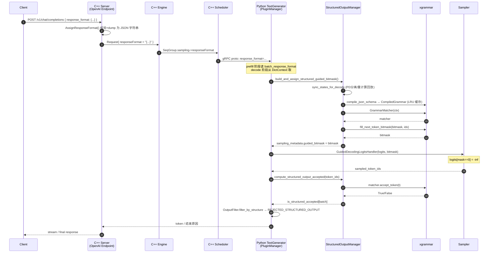
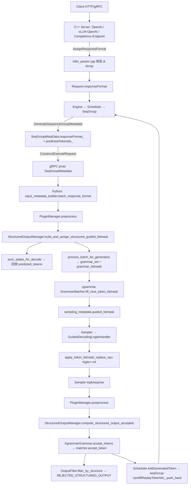

# 结构化输出（Structured Output）深度解读

> **适用版本**：MindIE-LLM master（git HEAD on `cursor/feature-analysis-skill-8380`）
> **分析方法**：本报告由 [`feature-analysis` Skill](../../../.cursor/skills/feature-analysis/SKILL.md) 七步法生成
> **关联文档**：`docs/zh/user_guide/feature/structured_output.md`、`docs/zh/release_notes.md`
> **后端依赖**：[xgrammar](https://github.com/mlc-ai/xgrammar)（FSM 约束 + token bitmask）

---

## 0. TL;DR

- **一句话定义**：通过 OpenAI 兼容 API 的 `response_format` 字段，借助 **xgrammar** 在每一步采样前生成 token bitmask，将不合规 token 的 logits 置为 `-inf`，**逐 token 约束**模型输出为合法 JSON / 满足 JSON Schema。
- **核心价值**：
  1. **零额外手动指令**即可保证下游可直接 `json.loads()`，免去解析失败重试；
  2. 对 Tool Call、数据抽取、Agent Pipeline 等强格式场景**精度从 ~80% 提升到 100% 的"格式合规率"**；
  3. 支持 PD 混部 / PD 分离 / Prefix Cache / SplitFuse 叠加，对生产链路侵入最小。
- **是否推荐生产开启**：✅ 在 **json/function-call 场景**默认开启；❌ **不要**与 MTP / 投机解码同时启用（代码已硬性拒绝）。

---

## 1. 需求价值（Why）

| 维度 | 内容 | 出处 |
|------|------|------|
| 业务收益 | 1) 输出 100% 合规为 JSON 且可被 `json.loads()` 解析；2) `json_schema` 模式下字段名 / 类型 / 枚举值严格受控；3) 失败的请求由引擎自动以 `REJECTED_STRUCTURED_OUTPUT` 标记，避免脏数据流向下游 | `docs/zh/user_guide/feature/structured_output.md`、`mindie_llm/text_generator/utils/output_filter.py:55–74` |
| 工程收益 | 1) 无需在 prompt 中手工"please return JSON"；2) 与现有 chat-completions / completions 通道**完全兼容 OpenAI 协议**，调用方零成本切换；3) Manager 内置 SHA256 grammar cache（默认 100 条）规避重复编译开销 | `src/server/endpoint/utils/infer_param.cpp:915-980`、`mindie_llm/text_generator/plugins/structured_output/structured_output_manager.py:1032-1060` |
| 适用场景 | Tool Call 结果解析、文本结构化抽取、Agent 多步规划、DB 查询生成、风控/合规字段输出 | `docs/zh/user_guide/feature/structured_output.md` "适用场景" |
| 反场景 | 1) 与 MTP / 投机推理叠加（已被硬性拒绝）；2) 单请求 schema 极复杂且 batch 大（bitmask 填充与 logits 掩码会进入热路径）；3) reasoning（思考）阶段需要自由 token——MindIE 未提供 SGLang 那样的"思考段放宽约束"开关 | `src/server/endpoint/utils/infer_param.cpp:220-223`、SGLang `structured_outputs_for_reasoning_models` 对照 |
| 量化预期 | 文档未直接给出 benchmark；按 xgrammar 论文/SGLang 公开数据，bitmask 单次填充开销在 **百 μs 级**，对 TPOT 影响 <5%。MindIE 在 NPU 上额外有 `torch.repeat_interleave + bit shift` 展开 mask 的成本（见 §5.1） | xgrammar 上游 + `mindie_llm/text_generator/plugins/structured_output/structured_output_bitmask.py:46-63` |

---

## 2. 需求设计（What）

### 2.1 抽象模型

```
请求侧：response_format ─┐
                        ▼
       ┌──────────────────────────────────┐
       │   StructuredOutputRequest         │  ← from_response_format(str)
       │   ├ output_type: JSON_OBJECT / JSON_SCHEMA
       │   └ grammar_spec: str (schema JSON)
       └──────────────────────────────────┘
                        │
                        ▼  GrammarCompiler.compile_json_schema
       ┌──────────────────────────────────┐
       │   CompiledGrammar (xgr.ctx)       │ ← 跨请求复用 + LRU 缓存
       └──────────────────────────────────┘
                        │
                        ▼  GrammarMatcher(ctx)
       ┌──────────────────────────────────┐
       │   XgrammarGrammar (per-request)   │
       │   ├ matcher: xgr.GrammarMatcher   │   ← FSM 状态
       │   ├ _num_tried_tokens             │   ← replay 游标（含 reject）
       │   ├ _num_processed_tokens         │   ← FSM 合法接受数
       │   └ _is_terminated                │
       └──────────────────────────────────┘
                        │
                        ▼  fill_next_token_bitmask
       ┌──────────────────────────────────┐
       │  bitmask [B, ⌈V/32⌉] int32       │  ← Manager 预分配 64 行
       └──────────────────────────────────┘
                        │
                        ▼  apply_token_bitmask_inplace
       logits[masked]=-inf → sample → accept_token → loop
```

### 2.2 端到端时序



### 2.3 关键配置项

| 配置项 | 默认 | 含义 | 出处 |
|--------|------|------|------|
| `enable_guided_decoding` | `True` | 是否启用 GuidedDecodingLogitsHandler | `mindie_llm/text_generator/utils/config.py:204` |
| `enable_structured_output` | `True` | 是否初始化 `StructuredOutputManager`（PluginManager 级） | `mindie_llm/text_generator/plugins/plugin_manager.py:121` |
| `guided_decoding_backend` | `"xgrammar"` | 后端类型；当前只有 `XGRAMMAR` 一个枚举值 | `plugin_manager.py:935`、`structured_output_manager.py:88-91` |
| `xgrammar_any_whitespace` | `True` | 是否允许任意空白（影响 JSON 数字/键名前后空白匹配） | `structured_output_manager.py:103` |
| `grammar_cache_size` | `100` | 编译后的 grammar LRU 缓存条数 | `structured_output_manager.py:104` |
| `bitmask_prealloc_batch` | `64` | bitmask 预分配的最大 batch 维度，超出会扩容 | `structured_output_manager.py:105, 1008-1014` |
| `response_format.type` | — | 请求级；`json_object` / `json_schema` / `text`（`text` 等价未启用） | `infer_param.cpp:933-944` |

### 2.4 数据通路上的关键字段

| 层 | 字段 | 路径 |
|----|------|------|
| C++ Request | `Request::responseFormat (std::optional<string>)` | `src/include/request_response/request.h:70` |
| C++ Sampling | `SamplingParams::responseFormat` | `src/include/sampling.h:58` |
| C++ Schedule Meta | `SequenceGroupMetaData::responseFormat_` + `predictedTokenIds_` | `src/include/dataclass/sequence_group_meta_data.h:99` |
| C++ SeqGroup | `SequenceGroup::prefillReplayTokenIds_` | `src/include/dataclass/sequence_group.h:110` |
| Proto (gRPC) | `model_execute_data.proto: response_format=34, predicted_token_ids=35` | `proto/model_execute_data.proto:170-171` |
| Python Request | `LLMRequest.response_format` | `mindie_llm/text_generator/utils/request.py:52` |
| Python Batch | `InputMetadata.batch_response_format`、`batch_predicted_token_ids` | `mindie_llm/text_generator/utils/input_metadata.py:97-100` |
| Python Sampling | `SamplingMetadata.guided_bitmask` | `mindie_llm/text_generator/utils/sampling_metadata.py:390-391` |
| Python Context | `AllDictContext.response_format[handle]` | `mindie_llm/text_generator/utils/batch_context.py:47-119` |

---

## 3. 代码结构（Where）

### 3.1 调用链路（双层骨干）



### 3.2 关键文件清单

| # | 路径 | 角色 |
|---|------|------|
| 1 | `src/server/endpoint/utils/infer_param.cpp` `AssignResponseFormat` | 服务端协议校验 + `text` 短路 + JSON dump |
| 2 | `src/server/endpoint/utils/infer_param.cpp:218-223` | **MTP/投机 互斥** 硬性拒绝 |
| 3 | `src/server/endpoint/single_req_infer_interface/single_req_infer_interface_base.cpp:942-944` | `reqStructuredOutput` 旗标计算 |
| 4 | `src/engine/seq_group_builder_from_infer_req.cpp:83` | 透传到 SamplingParams |
| 5 | `src/scheduler/scheduler.cpp:1086-1096` | 调度时写 `responseFormat_` + `predictedTokenIds_` |
| 6 | `src/scheduler/scheduler.cpp:1429-1438` | `AddGeneratedToken` 同步追加 `prefillReplayTokenIds_` |
| 7 | `proto/model_execute_data.proto:170-171` | gRPC 字段 |
| 8 | `mindie_llm/connector/common/input_metadata_builder.py:782-787` | proto → `batch_response_format` |
| 9 | `mindie_llm/text_generator/plugins/structured_output/structured_output_manager.py` | **核心管理器**：grammar 编译 / cache / bitmask 生成 / replay / 终止判断 |
| 10 | `mindie_llm/text_generator/plugins/structured_output/structured_output_grammar.py` | `XgrammarGrammar` FSM 包装 + 双计数器 |
| 11 | `mindie_llm/text_generator/plugins/structured_output/structured_output_bitmask.py` | NPU 上 `bitmask → -inf` 展开实现 |
| 12 | `mindie_llm/text_generator/samplers/logits_handlers/pta_handlers.py:91-131` | `GuidedDecodingLogitsHandler` 注册到 sampler chain |
| 13 | `mindie_llm/text_generator/samplers/sampler.py:274-317` | `split_sampling_metadata` 拆分 bitmask + `selector` 触发 handler |
| 14 | `mindie_llm/text_generator/plugins/plugin_manager.py:528-536, 707-754, 908-953` | preprocess/postprocess 织入 + 后端延迟初始化 |
| 15 | `mindie_llm/text_generator/utils/output_filter.py:55-74, 259` | 被拒绝序列标记为 `REJECTED_STRUCTURED_OUTPUT` |
| 16 | `mindie_llm/text_generator/utils/batch_context.py:47-119, 478-626` | `DictContext.response_format` 跨 prefill→decode 状态保持 |
| 17 | `tests/pythontest/cpu/text_generator/plugins/structured_output/` | 三个 UT 文件覆盖 manager/grammar/bitmask |

### 3.3 Python ↔ C++ 边界

- **C++ → Python 单向**：`responseFormat` 在 C++ 完成 schema 字符串持久化，**所有 FSM 状态都在 Python 层维护**（与 vLLM v1 / SGLang 一致）。
- **状态键统一**：双方都用 `context_handle = state_key`（C++ 侧的 sequence 上下文句柄），见 `tg_infer_context_store.py:373-374`。
- **proto 唯一新增字段**：`response_format`（34）与 `predicted_token_ids`（35），后者**专为 PD 分离/重计算回放设计**——这是 MindIE 与 vLLM/SGLang 最大的实现差异（详见 §6）。

---

## 4. 实现细节（How）

### 4.1 核心数据结构

```129:202:mindie_llm/text_generator/plugins/structured_output/structured_output_grammar.py
class XgrammarGrammar(StructuredOutputGrammar):
    def __init__(
        self,
        matcher: Any,  # xgr.GrammarMatcher
        vocab_size: int,
        ctx: Any,  # xgr.CompiledGrammar
    ):
        self.matcher = matcher
        self.vocab_size = vocab_size
        self.ctx = ctx
        self._num_processed_tokens = 0
        self._num_tried_tokens = 0
        self._is_terminated = False
```

- **`_num_tried_tokens`**：replay 游标，**含被 matcher 拒绝的 token**。该设计是为了对齐 C++ 侧"无条件存储的 rejected token"——即使 token 被 FSM 拒，C++ scheduler 的 `prefillReplayTokenIds_` 仍会保留，避免索引错位。
- **`_num_processed_tokens`**：FSM 合法接受数，仅用于日志/可观测。
- 两个计数器分离是 MindIE 独有的设计（vLLM 的 `XgrammarGrammar.num_processed_tokens` 只有一个），见 §6 trick 1。

### 4.2 关键算法 + 复杂度

| 操作 | 实现 | 复杂度 |
|------|------|--------|
| Grammar 编译 | `xgr.GrammarCompiler.compile_json_schema(spec)` | **O(schema 大小)**，重复编译用 LRU 缓存命中 |
| bitmask 生成 | `matcher.fill_next_token_bitmask(bm, idx)` | **O(V/32)** 写入，xgrammar 内部基于压缩 FSM trie |
| bitmask 应用 | `torch.repeat_interleave(bm, 32) + bit shift + masked_fill_(-inf)` | **O(B·V)** NPU kernel | 见 §6 trick 4 |
| accept_token | `matcher.accept_token(token)` | **O(log V)**（xgrammar 内部哈希） |
| replay 完整重放 | `accept_tokens(state, replay_tokens)` 逐 token | **O(len)**；失败时 fallback 到部分接受 |
| replay 后缀搜索 | 在 `[len-512, len)` 窗口内枚举起点重试 | **最坏 O(512·L)** —— 见 §6 不足 2 |

### 4.3 同步 / 并发 / 内存

- **完全单线程**：所有 grammar 状态 (`_request_grammars: Dict[int, StructuredOutputGrammar]`) 由 PluginManager 同步访问，无锁。
- **bitmask 预分配**：`_bitmask_buffer = np.zeros((64, ⌈V/32⌉), int32)`；超过 batch=64 自动扩容（永不缩回）。
- **bitmask 拷贝**：`grammar_bitmask()` 返回 `bitmask.copy()`，避免下游 split/sampler 重入时被覆盖（见 `structured_output_manager.py:509`）。代价是每步 host 端 `B·V/32` 字节分配。
- **Host↔Device**：bitmask 在 host 生成，每步 `torch.from_numpy(...).to(logits.device)` 一次 host→NPU 拷贝。
- **NPU stream**：apply 不显式 `synchronize`，依赖 sampler 流上原地修改。

### 4.4 错误处理 / 降级

| 场景 | 行为 | 位置 |
|------|------|------|
| `response_format` 字段缺失/类型错 | C++ 阶段抛参数错误 | `infer_param.cpp:920-940` |
| `type=text` | **静默短路**，不启用约束 | `infer_param.cpp:941-944`、`single_req_infer_interface_base.cpp:942-943` |
| `xgrammar` 未安装 | warning + `_structured_output_enabled=False`，整批降级为无约束 | `plugin_manager.py:948-953`、`structured_output_manager.py:190-215` |
| schema 编译失败 | `grammar_init` 返回 None，请求该步无约束 | `structured_output_manager.py:447-450` |
| token 被 FSM 拒绝 | `accept_token` 返回 False；`_num_tried_tokens` 仍前进；后续 `filter_by_structure` 将序列标记为 `REJECTED_STRUCTURED_OUTPUT` 并结束 | `structured_output_grammar.py:159-189`、`output_filter.py:55-74` |
| FSM 已 terminated 但还在 batch | bitmask 行被填为 `-1`（全允许），相当于"不再约束" | `structured_output_grammar.py:191-197`、`structured_output_manager.py:483-491` |
| 与 MTP/投机叠加 | 服务端**拒绝接收**请求 | `infer_param.cpp:220-223` |

### 4.5 可观测埋点

- **全部用 `logger.debug`/`warning`** 打点（前缀如 `[StructuredOutput][Bitmask]`、`[StructuredOutput][DecodeSync]`、`[StructuredOutput][Replay]`）。
- **缺失**：未对接 Prometheus / OTel；未导出"约束请求数 / 拒绝率 / grammar 编译次数 / cache 命中率"等关键指标——见 §6 不足 4。

---

## 5. 工程 Trick

### 5.1 双计数器（`num_tried_tokens` vs `num_processed_tokens`）

```164:189:mindie_llm/text_generator/plugins/structured_output/structured_output_grammar.py
        for token in tokens:
            # 无论 accept/reject，先推进 replay 游标，保证 num_tried_tokens 始终对齐
            # replay buffer 中的实际位置（含被 C++ 无条件存储的 rejected token）
            self._num_tried_tokens += 1
            accepted = self.matcher.accept_token(token)
            if not accepted:
                ...
                return False
            self._num_processed_tokens += 1
```

**收益**：在 PD 分离 / 重计算场景，C++ scheduler 的 `prefillReplayTokenIds_` 会**无差别存储所有 token**（包括之前被 FSM 拒绝的），decode 节点重建 grammar 时若用"已接受数"做切片，会把"原本已被拒绝的非法 token"再喂回 FSM 造成错位。本设计用 `num_tried_tokens` 作为 replay buffer 下标，保证幂等。

### 5.2 SHA256 + LRU 双层 grammar 缓存

```1032:1060:mindie_llm/text_generator/plugins/structured_output/structured_output_manager.py
    def _compile_grammar(self, output_type, grammar_spec) -> CompiledGrammar:
        cache_key = StructuredOutputManager._get_cache_key(output_type, grammar_spec)
        if cache_key in self._grammar_cache:
            stored_spec, compiled = self._grammar_cache[cache_key]
            if stored_spec == grammar_spec:
                return compiled
            # 哈希碰撞，按未命中处理
        ...
        if len(self._grammar_cache) >= self.config.grammar_cache_size:
            first_key = next(iter(self._grammar_cache))
            del self._grammar_cache[first_key]
```

**收益**：高并发同一 schema 请求只编译一次；缓存 value 保留 `spec` 字符串用于**抗哈希碰撞校验**——比 vLLM 直接用 `hash(str)` 做 key 更稳健。

### 5.3 NPU 上自写 bitmask kernel，避免对 CUDA 实现的耦合

```46:63:mindie_llm/text_generator/plugins/structured_output/structured_output_bitmask.py
def apply_token_bitmask_inplace_npu(logits, bitmask, vocab_size):
    mask_expanded = torch.repeat_interleave(bitmask, 32, dim=-1)
    bit_indices = torch.arange(32, device=logits.device, dtype=torch.int32).repeat(bitmask.shape[-1])
    bit_masks = (mask_expanded >> bit_indices) & 1
    ...
    logits[..., :effective_len] = logits[..., :effective_len].masked_fill_(bit_masks == 0, float("-inf"))
```

**收益**：xgrammar 上游 `apply_token_bitmask_inplace` 直接调用 CUDA kernel，无法用于昇腾 NPU。MindIE 用 `repeat_interleave + 位移 + masked_fill_` 三件套在 PyTorch+NPU 后端实现等价语义，**避免拉 CUDA 依赖**。

### 5.4 状态键 = `context_handle` 复用现有上下文池

`StructuredOutputManager` 不自建会话表，而是直接用 `state_key = context_handle`（C++ 侧序列上下文句柄），见 `tg_infer_context_store.py:373-374`、`batch_context.py:715-719`。**收益**：grammar 状态自动跟随序列生命周期被清理（`clear_finished_requests`），无内存泄漏风险。

### 5.5 Prefill 完成后即时回放

```662:673:mindie_llm/text_generator/plugins/structured_output/structured_output_manager.py
        if predicted_token_ids and input_metadata.is_prefill:
            self.replay_predicted_tokens_after_init(...)
            bitmask = self.process_batch_for_generation(...)
```

**收益**：PD 分离场景，P 节点 prefill 时已生成若干 token；D 节点接管时若不立即回放，bitmask 会基于"初始态"生成，导致首个 decode token 出现冗余 `{`。本路径**回放后强制重算一次 bitmask**，是 MindIE 针对 PD 分离的核心差异点。

### 5.6 `type=text` 服务端短路

```941:944:src/server/endpoint/utils/infer_param.cpp
    if (formatType == "text") {
        // text 等价于未启用结构化输出，按未传 response_format 处理。
        return true;
    }
```

**收益**：OpenAI 协议允许客户端显式声明"不要 JSON"。MindIE 在最外层短路，**避免无效 bitmask 计算**进入热路径，零额外开销。

### 5.7 `infer_param.cpp` 进行 schema 名称合法性硬约束

`ValidateJsonSchemaName` 强制 `json_schema.name` 为 1–64 字符非空字符串。**收益**：早早在协议层拒绝畸形请求，保护下游 Python xgrammar 编译器不被空 name / 超长 name 拖垮。

---

## 6. 实现不足 / 风险

### 6.1 单一后端，缺乏后备与多样性

`GuidedDecodingBackendType` 只有 `XGRAMMAR` 一个枚举。

```88:95:mindie_llm/text_generator/plugins/structured_output/structured_output_manager.py
class GuidedDecodingBackendType(str, Enum):
    """约束解码后端类型"""

    XGRAMMAR = "xgrammar"
```

- **vLLM** 同时支持 xgrammar / guidance(llguidance) / outlines / lm-format-enforcer，并通过 `--structured-outputs-config.backend=auto` 智能选择；
- **SGLang** 支持 xgrammar / outlines / llguidance，`--grammar-backend` 切换。
- **建议**：将 `GrammarBackend` 抽象进一步插件化（已经有 `_init_backend` hook），增加 `llguidance` 后端作为 Schema 复杂 / xgrammar 不支持时的 fallback（llguidance 对 JSON Schema 兼容性更好）。

### 6.2 仅支持 `json_object` / `json_schema`，**没有 regex / EBNF / choice / structural_tag**

```20:23:mindie_llm/text_generator/plugins/structured_output/structured_output_grammar.py
class StructuredOutputType(str, Enum):
    JSON_OBJECT = "json_object"  # 通用 JSON 对象约束
    JSON_SCHEMA = "json_schema"  # 用户指定 JSON Schema 约束
```

对比 vLLM `StructuredOutputsParams(json=..., regex=..., choice=..., grammar=..., structural_tag=...)`、SGLang `json_schema/regex/ebnf` —— MindIE 当前**只支持 JSON 一支**，无法满足：
- 严格匹配电话号 / 邮箱等正则；
- 限定为有限选项（choice），常用于分类、意图识别；
- 用 EBNF 表达 SQL / DSL；
- function-call 的 `structural_tag`（XGrammar 已支持，SGLang 已开放）。

**建议**：xgrammar 已原生支持上述类型（`Grammar.from_regex` / `from_ebnf` / `from_structural_tag`），扩展工作量集中在 `_compile_xgrammar` 的 type 分派 + 协议层校验。

### 6.3 缺乏 Jump-Forward Decoding

xgrammar 的 `find_jump_forward_string` 可在"FSM 唯一确定后续字符串时"**一次性输出多 token**，跳过整段决定性区域，显著减少 forward 次数。当前 MindIE 没有任何 `find_jump_forward_string` 调用：

- 已查证：仓库 `rg find_jump_forward` 无任何匹配。
- SGLang 已实现 jump-forward（参见 `python/sglang/srt/constrained/`），实际可减少 5–15% TPOT。

**建议**：在 `accept_tokens` 成功后，调用 `matcher.find_jump_forward_string()`，若非空则直接 emit 这串字符的 token 化结果并推进 FSM；需要解决三件事——token re-encoding 边界、采样路径中插入"虚拟 token"的协议、与 PD 分离 replay 路径的协同。

### 6.4 可观测性几乎全 debug log，缺 metrics

- 没有计数器 `grammar_compile_count` / `grammar_cache_hit` / `bitmask_apply_us` / `rejected_request_count` 等。
- vLLM 在 v1 已有 `structured_output_compile_seconds`、`structured_output_active_requests` 等 Prometheus 指标。

**建议**：将 §5.2 LRU 命中率、§6 拒绝率以 Prometheus counter/histogram 暴露到 `/metrics`，并在 `OutputFilter.filter_by_structure` 处增加 `rejected_structured_output_total`。

### 6.5 缺少 schema 兼容性预检

vLLM 在 backend_xgrammar 中有 `has_xgrammar_unsupported_json_features(schema)` 在**编译前**报错。MindIE 当前任何不支持的特性（如 `anyOf`、嵌套 `$ref`、远程 `$id`）都会等到 `compile_json_schema` 真正抛异常才被发现，错误信息不友好。

**建议**：在 `from_response_format` 之后、`compile_grammar` 之前增加预检层，按 xgrammar 文档维护一个不支持关键字白名单。

### 6.6 后缀搜索回退路径硬编码窗口 = 512，且最坏 O(N²)

```954:966:mindie_llm/text_generator/plugins/structured_output/structured_output_manager.py
        search_start = max(1, len(replay_tokens) - 512)
        for start_idx in range(search_start, len(replay_tokens)):
            self.clear_requests([state_key])
            if not self._init_grammar_from_response_format(state_key, response_format):
                return 0
            suffix_tokens = replay_tokens[start_idx:]
            if self.accept_tokens(state_key, suffix_tokens):
                ...
                return len(suffix_tokens)
```

- 窗口 `512` 是魔法数，长输出场景容易回退失败；
- 每轮都重建一次 grammar（含一次完整 schema 编译，虽有 LRU 缓存但仍有 matcher 重建成本），**最坏 512 次重建**；
- 失败时静默返回 0，对外不可见。

**建议**：(a) 配置化窗口大小；(b) 利用 xgrammar `max_rollback_tokens` 参数做 `rollback` 而非"销毁重建"；(c) 重试失败时打 error log + metrics。

### 6.7 与 MTP / 投机推理的硬冲突

```218:223:src/server/endpoint/utils/infer_param.cpp
    if (ctx.reqStructuredOutput) {
        error = "structured output (response_format) cannot be used with mtp";
        return false;
    }
```

直接拒绝请求。但本质上 MTP / 投机推理在草稿阶段只需**应用 bitmask 不推进 FSM**，验证通过的 token 再统一 accept——vLLM 已实现 spec-decode + structured-output 共存。**建议**：把"`accept_token` 推迟到 verify 阶段"的协议沉淀进 `StructuredOutputGrammar`，并放开 C++ 拦截。

### 6.8 bitmask 每步 `copy()` + host→device 拷贝

```509:509:mindie_llm/text_generator/plugins/structured_output/structured_output_manager.py
        return bitmask.copy()
```

为了应对 `sampler.split_sampling_metadata` 切片，做了 host 端整块拷贝；之后又一次 `torch.from_numpy(...).to(logits.device)`。

**建议**：(a) 直接复用 device-resident bitmask 缓冲；(b) 在 sampler 切片层用 `view` 替代拷贝；(c) 对 NPU 后端用 `npu_repeat_interleave` 融合 kernel。

### 6.9 reasoning（思考）阶段无法放宽约束

SGLang 提供 `--reasoning-parser`，在 `<think>...</think>` 段允许自由生成。MindIE 当前一旦开启约束，整段输出均受限——对 R1 / QwQ 系列推理模型而言会污染思考链。**建议**：与 `enable_reasoning` 特性联动，思考段把 grammar 切到"全放行"状态。

---

## 7. vLLM / SGLang 竞品对比

### 7.1 概念映射

| 通用概念 | MindIE-LLM | vLLM v1 | SGLang |
|----------|-----------|---------|--------|
| 请求字段 | `response_format` (OpenAI 兼容) | `structured_outputs` (旧 `guided_*` 已在 v0.12.0 移除) | `json_schema` / `regex` / `ebnf` / `structural_tag` |
| 调度位置 | `StructuredOutputManager` (PluginManager 内) | `vllm/v1/structured_output/` 独立模块 | `python/sglang/srt/constrained/` |
| 状态机 | `XgrammarGrammar` 双计数器 | `XgrammarGrammar` 单计数器 | `GrammarBackend.{xgrammar,outlines,guidance}` |
| Bitmask | host 生成 → NPU 自写 kernel apply | host 生成 → CUDA kernel apply | host 生成 → CUDA kernel apply |

### 7.2 13 维对比矩阵

| # | 维度 | MindIE-LLM | vLLM | SGLang | 差距 / 优势 | 借鉴点 |
|---|------|-----------|------|--------|-------------|--------|
| 1 | 后端数量 | **1**（xgrammar） | 4（xgrammar / guidance / outlines / lm-format-enforcer） | 3（xgrammar / outlines / llguidance） | **落后** | vLLM `backend_guidance.py`、SGLang `--grammar-backend` |
| 2 | 后端自动选择 | 否 | `auto` 根据 schema 复杂度选 | 否（默认 xgrammar） | 落后 | vLLM `--structured-outputs-config.backend=auto` |
| 3 | 约束类型 | json_object / json_schema | json / regex / choice / grammar / structural_tag | json_schema / regex / ebnf / structural_tag | **落后** | xgrammar `Grammar.from_regex/from_ebnf/from_structural_tag` |
| 4 | Jump-Forward Decoding | ❌ | ❌（部分场景） | ✅（默认开启） | 落后 | SGLang `RadixCache + JumpForward` |
| 5 | Schema 预检 | ❌ | ✅ `has_xgrammar_unsupported_json_features` | ✅ | 落后 | vLLM backend_xgrammar 校验函数 |
| 6 | Grammar 缓存 | SHA256+LRU（100 条）+ 抗碰撞 spec 校验 | LRU（per-engine） | LRU + radix-cache 共享 | **持平 / 抗碰撞领先** | — |
| 7 | PD 分离 | ✅ `prefillReplayTokenIds_` + replay 协议 | 实验性 | ✅ (Mooncake) | **领先** | — |
| 8 | 与 Prefix Cache 叠加 | ✅ | ✅ | ✅ | 持平 | — |
| 9 | 与 Speculative Decoding 叠加 | ❌ 硬拒绝 | ✅ | ✅（EAGLE 兼容） | **落后** | vLLM 的"草稿不推进 FSM" |
| 10 | Reasoning 段放宽 | ❌ | 部分支持 | ✅ `--reasoning-parser` | 落后 | SGLang `structured_outputs_for_reasoning_models` |
| 11 | Bitmask 后端 | NPU 自写 `repeat_interleave + masked_fill_` | xgr CUDA kernel + Triton | xgr CUDA kernel + Triton | NPU 独有 | — |
| 12 | 可观测性 | 仅 debug log | Prometheus（compile_seconds / active） | Prometheus + OTel | **落后** | vLLM `metrics.py` 中 structured_output_* |
| 13 | 失败兜底 | 拒绝序列 + `REJECTED_STRUCTURED_OUTPUT` 结束 | 报错 + retry policy | 重试 / 跳过 | 持平 | — |

### 7.3 结论

- **领先（值得对外宣传）**：
  1. PD 分离场景下的 `prefillReplayTokenIds_` + 双计数器 replay 协议——目前 vLLM/SGLang 在 disaggregated serving + structured output 的稳定性上仍属"实验性"。
  2. NPU 上自写的 `apply_token_bitmask_inplace_npu`，让 Ascend 用户开箱可用。
  3. 服务端 `text` 短路 + name 长度硬约束等防御性细节。

- **对齐**：缓存策略、Prefix Cache 协同、错误兜底。

- **落后（优先级排序）**：
  1. **约束类型仅 JSON**（影响 Tool Call、structural_tag、regex/choice 用户群）→ 工作量集中在 `_compile_xgrammar` + 协议层。
  2. **Jump-Forward Decoding 缺失** → TPOT 优化空间 5–15%。
  3. **后端单一，无 llguidance/outlines fallback** → 复杂 schema 容易直接失败。
  4. **与 Speculative/MTP 互斥** → 商业化高价值场景（high-throughput function-call）受限。
  5. **Reasoning 段无法放宽** → R1 / QwQ 类推理模型上质量受损。
  6. **无 Prometheus 指标** → 生产可观测性差。

- **优先借鉴清单**：
  1. `vllm/v1/structured_output/backend_xgrammar.py` 的 type 分派与 schema 预检；
  2. `vllm/v1/structured_output/backend_guidance.py` 引入 llguidance 后端；
  3. SGLang `python/sglang/srt/constrained/grammar_backend/` 的 jump-forward 实现；
  4. SGLang `structured_outputs_for_reasoning_models.html` 的思考段放宽策略；
  5. xgrammar `find_jump_forward_string` 用法。

---

## 8. 补充维度

| 维度 | 现状 | 建议 |
|------|------|------|
| 精度对齐 | UT 覆盖 manager/grammar/bitmask 三件套；缺少与 xgrammar reference / vLLM 输出 token 序列对齐脚本 | 增加 `tools/` 下"同 schema 同 prompt 跨引擎 token-level 对齐"脚本 |
| 性能基准 | 无专项 benchmark；`tools/` 没有 structured-output workload | 引入 `bfcl` / `json-mode-eval` 基准，提供 TTFT / TPOT / 拒绝率三指标 |
| 可观测性 | 仅 debug/warning log，无 metrics、无 trace | 见 §6.4 |
| 安全性 | C++ 服务端校验 `type` 枚举 + 名称长度；schema 深度由 `CheckJsonDepthCallback` 限制 | 增加 schema 体积上限（防 DoS） + grammar 编译超时熔断 |
| 兼容矩阵 | `feature/README.md` 显示与 splitFuse / prefix cache 兼容，与 MTP 不兼容 | 兼容矩阵中补充 "与 lookahead / EAGLE / EPLB" 行 |
| Feature Flag | `enable_guided_decoding`、`enable_structured_output` 两级开关 | 增加 `guided_decoding_backend=xgrammar|llguidance|outlines` 环境变量 |
| 测试覆盖 | `tests/pythontest/cpu/.../structured_output/` 3 个文件；`tests/dlt/ut/server/...` 验证 C++ 协议 | 增加：(a) PD 分离 replay 路径 e2e；(b) 长 replay (>512) 后缀回退；(c) 与 prefix cache 叠加；(d) schema 不兼容报错路径 |
| 演进路线 | release_notes 2.3.0 (2026Q1) 引入 `response_format` | 路线图：多后端 → jump-forward → spec-decode 共存 → reasoning 放宽 |
| 跨团队边界 | 依赖 ATB 不强；对 xgrammar 版本敏感 | 在 requirements 锁定 xgrammar 最小版本，CI 增加 xgrammar 多版本矩阵 |
| 历史故障 | release_notes `#Issue257` / `#Issue358` 引入； `#Issue205` 大 EP P 节点 chunk prefill + Prefix cache + MTP + Tool calls 叠加 | 后续合规问题可专门收集 |

---

## 9. 行动建议

### 短期（≤3 条）

1. **可观测**：在 `mindie_llm/text_generator/plugins/structured_output/structured_output_manager.py` 增加 5 个 metrics —— grammar_compile_total / grammar_cache_hit / bitmask_fill_us / rejected_total / active_requests，并经由现有 `/metrics` 暴露。改动文件 ≤2 个，无侵入。
2. **可控**：把 §6.6 的硬编码 `512` 提到 `StructuredOutputConfig.replay_suffix_window`，并打 warning 日志 + 失败 metric。
3. **健壮**：在 `_init_grammar_from_response_format` 之前增加 schema 预检函数 `_validate_schema_compat(schema)`，对 xgrammar 不支持的关键字（如远程 `$ref`、`$id`、`patternProperties`）尽早报错。

### 中期（≤3 条）

1. **多后端**：把 `GuidedDecodingBackendType` 扩展为 `XGRAMMAR | LLGUIDANCE | OUTLINES`，仿照 vLLM `backend_guidance.py` 接入 llguidance 作为复杂 schema 的 fallback。`_init_backend` 已经是 hook，工作量集中在新增 `GuidanceBackend` 类 + 协议层 type 映射。
2. **多约束类型**：把 `StructuredOutputType` 扩展为 `JSON_OBJECT | JSON_SCHEMA | REGEX | EBNF | CHOICE | STRUCTURAL_TAG`，并在 `_compile_xgrammar` 中按 type 调用 `Grammar.from_regex/from_ebnf/from_structural_tag`。
3. **Jump-Forward**：在 `accept_tokens` 成功后调用 `matcher.find_jump_forward_string()`，与 sampler 协商"虚拟多 token emit"协议；预期 TPOT 优化 5–15%。

### 开放问题

1. PD 分离场景下，jump-forward 与 `prefillReplayTokenIds_` 的一致性如何维护？
2. 是否需要按租户限制 schema 大小 / 编译耗时（防 DoS）？
3. 是否引入 grammar 编译异步线程池，避免阻塞 prefill 关键路径？
4. 与 MTP / 投机推理共存的协议契约该建在哪一层（Sampler 还是 Manager）？
